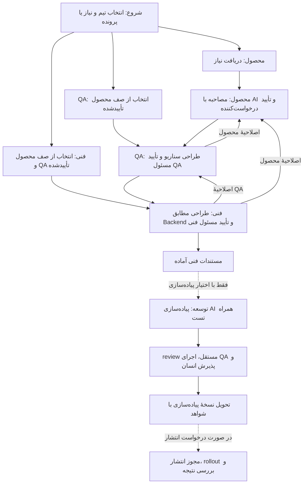

# مسیر توسعه از ایده تا تحویل

نسخهٔ ۱٫۵ — آمادهٔ بازبینی و استفادهٔ آزمایشی؛ تصویب سازمانی هنوز ثبت نشده است.

این مجموعه قرارداد همکاری **محصول → QA → فنی → توسعه‌دهندهٔ AI → بازبینی و پذیرش** است. هر مرحله بستهٔ نسخه‌دار به مرحلهٔ بعد می‌دهد؛ ابهام به صاحب تصمیم برمی‌گردد. مستندشدن، تأییدشدن و اجراشدن سه وضعیت متفاوت‌اند.

قواعد محصول، QA، طراحی فنی، قالب‌ها، مثال‌ها و بررسی مستندات در همین مخزن نگه‌داری می‌شوند. یک clone مستقل برای استفاده از این مجموعه کافی است؛ مخزن کدِ هدف فقط هنگام بررسی وضع موجود، طراحی منطبق با آن یا اجرای کد به‌عنوان ورودی پرونده معرفی می‌شود.

## از کجا شروع کنیم؟

1. از [انتخاب تیم](workflows/00-team-entry.md) شروع کنید: **«از کدام تیم هستی؟ محصول / QA / فنی»**. تیمی که کاربر از ابتدا گفته دوباره پرسیده نمی‌شود.
2. **محصول:** نیاز موجود را بخوانید یا بپرسید چه کاری باید انجام شود؛ درخواست تازه از I01 و سپس مصاحبه، نگارش و تأیید محصول پیش می‌رود. پروندهٔ موجود از checkpoint ادامه می‌یابد.
3. **QA:** [صف پرونده‌ها](requests/board.json) را از مدارک واقعی تطبیق دهید؛ اسناد محصولِ تأییدشده و آمادهٔ QA را فهرست کنید. پس از انتخاب کاربر و دریافت نسخه در Q01، طراحی QA آغاز می‌شود.
4. **فنی:** پرونده‌های دارای محصول و QA کامل و معتبر را نمایش دهید؛ پس از انتخاب و دریافت در T01، مستندات فنی و بسته‌های ماژولی تهیه می‌شوند. پایان پیش‌فرض این انتخاب، تحویل مستندات است؛ پیاده‌سازی اختیار جدا می‌خواهد.
5. هر پرونده وضعیت، تیم مسئول و سابقهٔ جابه‌جایی دارد. اصلاحیه آن را با دلیل به صف تیم مسئول برمی‌گرداند؛ پس از اصلاح و تأیید نسخهٔ لازم دوباره تحویل می‌شود. [قواعد وضعیت و بازگشت](docs/02-state-and-versioning.md) و [gateها](docs/04-gates.md) معیار این جابه‌جایی‌اند.
6. [نقشهٔ nodeها](workflows/README.md)، [قالب‌های پرونده](templates/README.md) و [اتصال به Backend](docs/05-backend-binding.md) جزئیات اجرا را دارند. [نمونهٔ OTP](examples/otp-issue/README.md) آموزشی است و در صف آماده نمایش داده نمی‌شود.

## راهنمای مجموعه

| بخش | کاربرد |
|---|---|
| [ورودی تیم و صف کار](workflows/00-team-entry.md) | شروع گفت‌وگو، انتخاب پرونده و ادامهٔ کار |
| [برد JSON پرونده‌ها](requests/board.json) | وضعیت جاری کارت‌ها و ارجاع مدارک |
| [قرارداد JSON برد](docs/07-board-json.md) | فیلدها، قالب کارت، نوشتن و نمایش صف |
| [مالکیت فایل‌های تیم‌ها](docs/08-team-file-ownership.md) | هر تیم فقط فایل‌های خودش را می‌نویسد؛ اصلاح فایل دیگر با ارجاع به مالک |
| [مستندسازی مستقل محصول](docs/09-product-authoring.md) | routing، مصاحبه، عمق اسناد، پذیرش و تحویل محصول |
| [اصول و نقش‌ها](docs/01-principles-and-roles.md) | چه کسی تصمیم می‌گیرد و چه کسی می‌نویسد |
| [نسخه، وضعیت و بازگشت](docs/02-state-and-versioning.md) | جلوگیری از تأیید یا شواهد منقضی |
| [ساختار اسناد](docs/03-artifact-map.md) | محل حقیقت هر تصمیم و حداقل مدارک |
| [دروازه‌ها](docs/04-gates.md) | شرایط آماده‌بودن و پایان هر مرحله |
| [Backend](docs/05-backend-binding.md) | قواعد واقعی، مسیر کد و verification |
| [ورود اسناد قدیمی](docs/06-adoption.md) | ورود اختیاری اسناد موجود بدون فرض تأیید |
| [گزارش بررسی منابع](research/source-review.md) | یافته‌ها، محدودیت مطالعه و منابع |
| [قرارداد اجرای node](workflows/00-node-contract.md) | ورودی، مسئول، نتیجه، retry و توقف |
| [قالب‌ها](templates/README.md) | بسته‌های قابل کپی و تکمیل |
| [اعتبارسنجی](scripts/README.md) | لینک‌ها، ساختار nodeها و Mermaid |
| [ثبت طراحی و تأیید](records/design-review.md) | خواسته‌های قطعی و انتخاب‌های پیشنهادی این نسخه |

## دامنهٔ تحویل

این مخزن مستندات و ابزار بررسی همان مستندات را دارد؛ موتور اجرای workflow یا اتصال خودکار به پیام‌رسان/CI نیست. مسیرها را انسان و AI از روی کارت node اجرا می‌کنند. تبدیل بعدی به هر ابزار workflow باید همین ورودی‌ها، gateها و شاخه‌ها را حفظ کند. ارسال خارجی، merge و deploy نیازمند اختیار همان عمل‌اند؛ handover داخل پرونده به معنای ارسال پیام نیست.

پایان مسیر مستندسازی، بستهٔ فنی تأییدشده و تحویل مشخص است. اگر پیاده‌سازی نیز صریحاً در scope باشد، مسیر تا review، شواهد اجرا و پذیرش ادامه می‌یابد؛ انتشار مسیر اختیاری جدا دارد.
