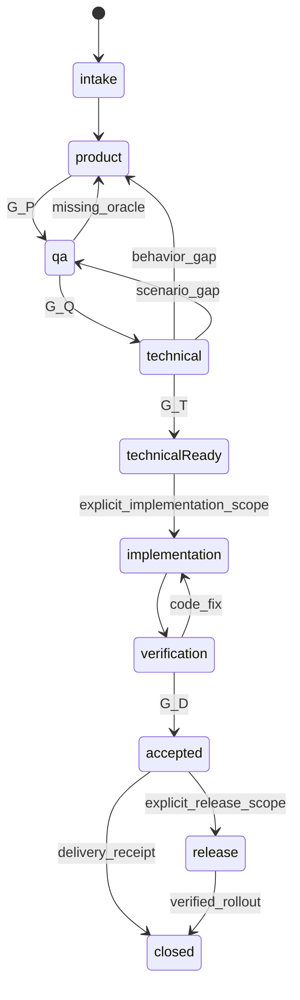

# وضعیت، نسخه و ادامهٔ کار

## واحد نسخه

`request-id` پایدار و انسانی‌خوان، مانند `REQ-2026-001` است؛ نام ماژول شناسهٔ درخواست نیست. یک درخواست چند ماژول دارد و هر rule/UC/AC/QA/TECH/TASK/DEF شناسهٔ پایدار با namespace درخواست یا ماژول دارد. شمارهٔ حذف‌شده دوباره استفاده نمی‌شود.

هر تحویل یک `baseline-id` جدید مانند `REQ-2026-001-P1` می‌سازد. manifest فهرست مسیر نسبی، repository، revision و SHA-256 فایل‌ها را دارد؛ اگر Git موجود نیست، hash و snapshot immutable کافی است. دسترسی دریافت‌کننده به همان bytes الزامی است. manifest خودش را hash نمی‌کند؛ approval و receipt بیرون بسته‌اند تا وابستگی دوری ایجاد نشود.

**approval** نتیجهٔ تصمیم انسان روی digest دقیق manifest است. **receipt** یعنی دریافت‌کننده همان نسخه را باز کرده و ورودی کافی را پذیرفته است؛ این دو یکی نیستند. تغییر فایل، حتی نگارشی، hash تازه می‌دهد. برای تغییر صرفاً نگارشی review کوتاه و تأیید نسخهٔ تازه کافی است؛ مصاحبهٔ کامل تکرار نمی‌شود. تاریخچهٔ approval قبلی پاک یا بازنویسی نمی‌شود.

## وضعیت‌های پرونده

| وضعیت | معنی | گذار مجاز |
|---|---|---|
| intake | خواسته دریافت و در حال دسته‌بندی است | product-draft، bug-triage، change-analysis |
| product-draft | مصاحبه/نگارش رفتار | product-review، waiting-human |
| product-review | review نسخهٔ محصول | product-draft، product-approved |
| product-approved | G-P پاس؛ QA باید دریافت کند | qa-design |
| qa-design | سناریو و پوشش در حال تدوین | qa-approved، product-draft |
| qa-approved | G-Q پاس؛ فنی باید دریافت کند | technical-design |
| technical-design | مدل، قرارداد و اجرای آزمون طراحی می‌شود | technical-approved، qa-design، product-draft |
| technical-approved | G-T پاس؛ مستندات فنی آماده است؛ اختیار اجرای کد جداست | implementing فقط با دستور صریح scope؛ در غیر این صورت پایان scope مستندسازی و HOLD ادامهٔ توسعه |
| implementing | sliceها با تست ساخته می‌شوند | verifying، technical-design |
| verifying | review کد و اجرای QA روی candidate | implementing، accepted، change-analysis |
| accepted | G-D پاس؛ تحویل ثبت شده | closed یا release-pending |
| release-pending | انتشار خواسته شده، اختیار/پیش‌نیاز لازم است | releasing، waiting-human |
| releasing | rollout مجاز در حال اجرا | closed، blocked، verifying |
| closed | scope خواسته‌شده با evidence تحویل شده | درخواست جدید یا reopen مستند |
| waiting-human / blocked / paused | ادامهٔ node وابسته ممکن نیست | فقط با رفع علت به `resumeNode` |
| cancelled | لغو صریح انسان با ثبت اثرات و تحویل | درخواست تازه؛ ادامهٔ ضمنی ممنوع |

این وضعیت‌ها وضعیت پرونده‌اند؛ وضعیت هر node جداست: pending، running، waiting-human، blocked، completed، failed، cancelled. node تکمیل‌شده با output قدیمی برای input جدید completed محسوب نمی‌شود.

نمودار مسیر عادی را نشان می‌دهد؛ مسیر باگ و تغییر در C/B nodeها و توقف‌های عمومی در قرارداد node تعریف شده‌اند.

## کارت کانبان و صف تیم‌ها

هر درخواست یک کارت با شناسهٔ ثابت دارد؛ جابه‌جایی بین تیم‌ها سند محصول و QA را به پرونده‌های جدا تبدیل نمی‌کند. [برد JSON](../requests/board.json) تنها محل ثبت وضعیت جاری است و هر کارت به journal و مدارک پرونده ارجاع دارد؛ `tracking.md` صرفاً تاریخچهٔ جابه‌جایی و شرح اصلاحیه‌هاست. `request.md` برای شرح و scope است و وضعیت موازی نگه نمی‌دارد.

| state یا وضعیت عملیاتی | ستون برد | تیم صاحب اقدام بعدی |
|---|---|---|
| intake / product-draft | محصول: نیاز / در حال تدوین | محصول |
| product-review | محصول: در انتظار بازبینی و تأیید | محصول؛ تأیید با همان درخواست‌کننده |
| product-approved و P08 کامل، nextNode=Q01 | آمادهٔ QA | QA؛ receipt هنوز pending |
| qa-design | QA: در حال تدوین و بازبینی | QA |
| qa-approved و Q06 کامل، nextNode=T01 | آمادهٔ فنی | فنی؛ receipt هنوز pending |
| technical-design | فنی: در حال تدوین و بازبینی | فنی؛ review لازم QA با نقش خودش انجام می‌شود |
| technical-approved و T08 کامل | مستندات فنی آماده | صاحب اقدام بعدی طبق scope؛ بدون اختیار، توسعه شروع نمی‌شود |
| اصلاحیهٔ باز | برگشتی برای اصلاح، با ذکر تیم مقصد | صاحب علت؛ state مرحلهٔ مقصد و resumeNode نیز ثبت می‌شوند |
| waiting-human / blocked / paused | منتظر پاسخ / مسدود / متوقف | نقش صاحب رفع علت؛ state قبلی و resumeNode حفظ می‌شوند |
| bug-triage / change-analysis | بخش باگ/اصلاحیهٔ همان تیم با ذکر node | از نقش B/C node جاری تعیین می‌شود؛ gate کوتاه باگ حذف نمی‌شود |
| implementing و مراحل بعدی / closed / cancelled | ادامهٔ توسعه / تحویل / بسته‌شده | نقش مرحلهٔ مربوط؛ خارج صف شروع QA یا طراحی فنی |

«برگشتی» نوع اقدام و نمای کارت است؛ جای state دقیق و node را نمی‌گیرد. اگر پرونده هم برگشتی و هم منتظر پاسخ است، یک کارت در بخش برگشتی با نشان انتظار و علت نمایش داده می‌شود. در سایر موارد، توقف بر ستون آماده مقدم است. gate پاس‌شده ولی handover ناقص در تیم فرستنده می‌ماند؛ ستون آماده فقط با همهٔ شرایط [ورودی تیم](../workflows/00-team-entry.md) مجاز است. پروندهٔ technical-approved بدون اختیار کد در ستون «مستندات فنی آماده» می‌ماند؛ HOLD توسعه به معنی ناقص‌بودن مستندات نیست.

هنگام نمایش صف، ابتدا مدارک پرونده‌ها را بخوان و اعتبار scope، manifest/hash، parentها، approval، دریافت‌های قبلی و اصلاحیه‌ها را تطبیق بده. سپس کارت JSON را به‌روز و جدول نمایشی را از آن بساز. پروندهٔ بدون کارت، فاقد tracking یا دارای تعارض، با علت نیاز به تطبیق نمایش داده می‌شود؛ از صف آماده خارج است. هنگام انتخاب کاربر، این بررسی تکرار می‌شود تا نسخهٔ عوض‌شده وارد مرحلهٔ بعد نشود. نویسندهٔ هماهنگ‌کننده یک writer است؛ قطع کار بین ثبت journal و برد با تطبیق کارت JSON از مدارک و تاریخچه رفع می‌شود، نه با تکرار approval.

هنگام ثبت برگشت، movement و return-id، مبدأ/مقصد تیم و node، نسخه، دلیل و معیار اصلاح را ثبت کن. مرحلهٔ قبلی بخش متأثر را اصلاح می‌کند؛ سابقه پاک نمی‌شود. تحویل مجدد پس از رفع موارد stale و gate لازم صورت می‌گیرد و اصلاحیه با دریافت معتبر مقصد بسته می‌شود. اشکال دسترسی بدون تغییر bytes فقط به رفع دسترسی و دریافت نیاز دارد. این حرکت پیام خارجی ارسال نمی‌کند.

## تغییر upstream و ابطال وابستگی

| تغییر | چه چیزی دوباره بررسی می‌شود؟ |
|---|---|
| رفتار یا scope محصول | rule/ACهای متأثر، QA، طراحی و taskها؛ approval همان subgraph stale |
| oracle یا سناریوی QA | coverage و test mapping، فنی، اجراهای متأثر؛ اگر انتظار عوض شده ابتدا محصول |
| تصمیم فنی/API/data | tech approval، task و تست‌های مرتبط؛ محصول فقط اگر معنا تغییر کرد |
| کد candidate | review و شواهد مرتبط revision قبلی stale؛ impact تعیین‌کنندهٔ rerun |
| baseline معماری Backend | طراحی و validation قواعد تغییرکرده؛ مرجع جدید را بدون review جایگزین نکنید |

Coordinator در change-impact، مجموعهٔ IDهای متأثر، dependents و دلیل unaffectedها را ثبت می‌کند. توسعهٔ مستقل می‌تواند ادامه یابد؛ gate بستهٔ نهایی تا رفع موارد stale عبور نمی‌کند. برای دامنهٔ کاهش‌یافته، scope و manifest تازه همراه تأیید انسانی می‌سازید؛ حذف تست شکست‌خورده راه کاهش scope نیست.

## وقفه، retry و هم‌زمانی

در journal هر node: ورودی و digest، attempt، actor، شروع/پایان، خروجی، نتیجه و next node ثبت می‌شود. پس از قطع جلسه، اول journal و اثر واقعی خوانده می‌شود؛ از تکرار merge، ارسال یا migration به علت timeout خودداری می‌شود. نگارش تکراری روی همان input با diff ادغام می‌شود؛ approval فقط یک بار برای همان decision ثبت می‌شود.

یک writer فعال برای هر artifact تعیین کنید. تغییر هم‌زمان نیازمند reconcile نسخه پیش از freeze است. reviewer بستهٔ منجمد می‌گیرد. پس از دو دور اصلاح تکراری با همان blocker، Coordinator مسئله و دو راه حل را برای owner انسانی جمع‌بندی می‌کند؛ این سقف، اجازهٔ عبور از gate نیست. کار مستقل متوقف نمی‌شود.

## تغییر اثر ماژولی

افزودن/حذف ماژول یا تغییر contract edge در impact-map، یک تغییر scope فنی قابل ردیابی است. C01 هم producer و هم consumer و integration/end-to-end مربوط را باز می‌کند؛ ادعای unaffected بودن نیاز به شاهد دارد. approval و evidence ماژول‌های مستقل تنها با دلیل اثرناپذیری معتبر می‌مانند. یک manifest T در سطح درخواست، impact-map و تمام بسته‌های ماژولی و اسناد canonical اشاره‌شده را به نسخهٔ دقیق وصل می‌کند؛ رأی‌های ماژولی روی همین manifest ثبت می‌شوند.

journal nodeهای تکرارشونده `workUnit` شامل نوع/شناسه target و slice/task دارد؛ مثلاً دو اجرای D03 برای دو owner، دو workUnit متفاوت‌اند. attempt برای retry همان workUnit است. writer فایل مشترک request و host از writer ماژول‌ها جدا و مشخص است؛ این تفکیک به‌خودی‌خود اجرای موازی agentها را مجاز نمی‌کند.
