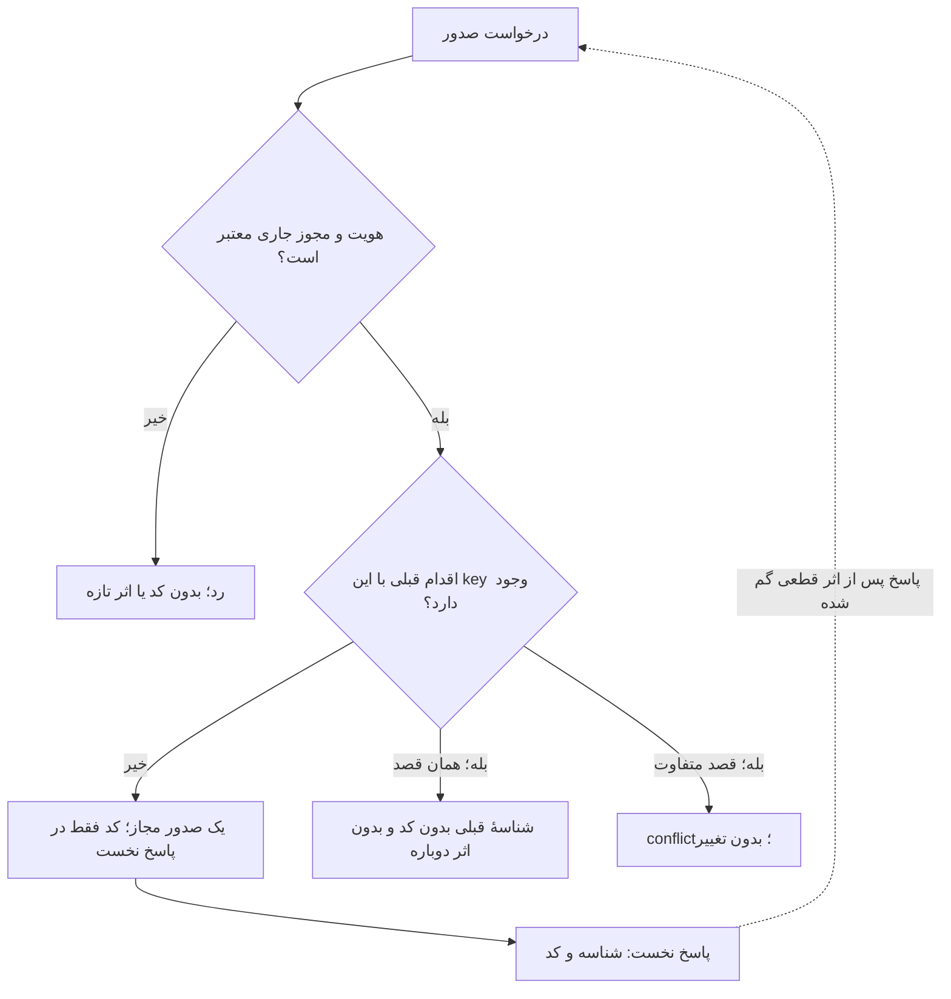
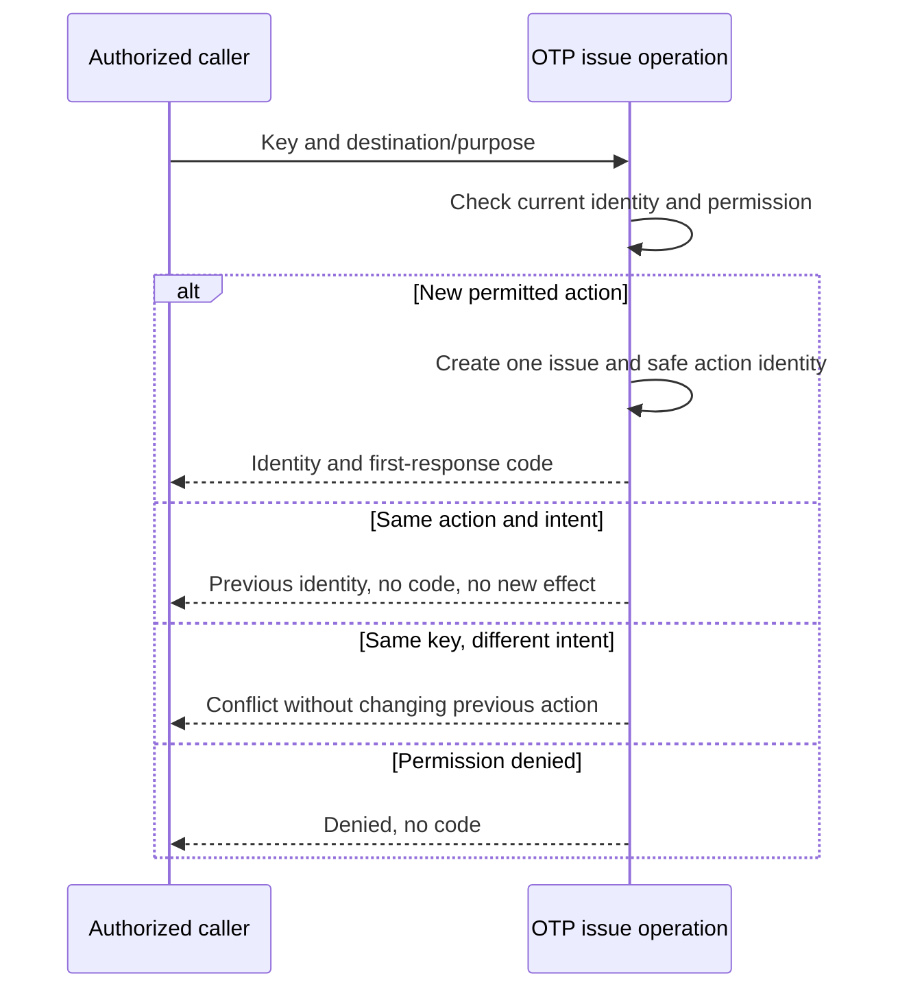

# محصول: قرارداد مستقل صدور و تکرار درخواست

وضعیت: **مثال آموزشی، بدون approval انسانی**. این فایل تمام انتظارهای محصولِ slice آموزشی را تعریف می‌کند؛ [پذیرش‌ها](acceptance.md) و [QA](qa.md) به همین قواعد محلی ارجاع می‌دهند. این مثال قرارداد کامل یک ماژول OTP یا دستور پیاده‌سازی نیست.

## مسئله، scope و بازیگر

سرویس مصرف‌کننده ممکن است پاسخ صدور را در شبکه نگیرد و همان درخواست را تکرار کند. یک قصد صدور نباید دوباره اثر ایجاد کند و کد خام نباید در پاسخ replay دوباره افشا شود. بازیگر، سرویس داخلی با هویت معتبر و مجوز جاری برای همان مقصد/کاربرد است. ارسال پیام به مخاطب، مسئولیت مصرف‌کننده است.

داخل scope: یک صدور مجاز، replay همان قصد، تعارض کلید/قصد، رقابت همان اقدام، قطع پاسخ پس از اثر قطعی، قطع مجوز و حفاظت کد خام. خارج scope: Verify/Cancel، اعداد سهمیه و زمان، انقضا/پاک‌سازی، رویداد عمومی، سیاست صدور تازه و اتصال ماژول مصرف‌کننده. برای اجرای واقعی، تصمیم‌های مربوط به آن دامنه جدا دریافت و scope مصوب می‌شوند؛ برای فهم و مرور این مثال نیازی به سند بیرونی نیست.

## قواعد همین مثال

| RULE-ID | قاعدهٔ قابل مشاهده | UC / AC |
|---|---|---|
| DEMO-P01 | هویت معتبر و مجوز جاری در صدور و replay بررسی شود؛ شناسهٔ قبلی مجوز دسترسی نمی‌سازد | DEMO-UC-01 / DEMO-AC-05 |
| DEMO-P02 | پاسخ صدور نخست می‌تواند شناسه و کد خام را یک بار برگرداند؛ پاسخ replay کد ندارد | DEMO-UC-01 / DEMO-AC-01/03/04 |
| DEMO-P03 | همان key با همان intent شناسهٔ قبلی را برگرداند و صدور/اثر سهمیه را دوباره ایجاد نکند | DEMO-UC-01 / DEMO-AC-01/03 |
| DEMO-P04 | همان key با مقصد یا کاربرد متفاوت conflict است و هیچ تغییر/صدور تازه ایجاد نمی‌کند | DEMO-UC-01 / DEMO-AC-02 |
| DEMO-P05 | رقابت یک key/intent حداکثر یک صدور واقعی و حداکثر یک پاسخ دارای کد ایجاد کند | DEMO-UC-01 / DEMO-AC-04 |
| DEMO-P06 | کد خام ذخیره و در log، trace، خطا یا evidence ثبت نشود؛ فقط پاسخ نخست مجاز است | DEMO-UC-01 / DEMO-AC-06 |

این قواعد انتظار آموزشی‌اند؛ فناوری lock، fingerprint، schema، Work و transport تصمیم محصول نیستند. در fixture پیش‌شرط صدور مجاز فرض می‌شود؛ هیچ عدد سهمیه یا زمان از مثال به پروندهٔ واقعی منتقل نمی‌شود.

## DEMO-UC-01 — صدور و ادامهٔ همان اقدام

- بازیگر و ورودی: سرویس مجاز، مقصد و کاربرد ساختگی، key پایدار همان اقدام؛ intent با مقصد/کاربرد مشخص می‌شود. key تازه، اقدام تازه است و مجوز replay برای صدور جدید نمی‌سازد.
- پیش‌شرط: هویت معتبر، مجوز جاری، قصد معتبر و پیش‌شرط صدور همان fixture برقرار است. اطلاعات احراز هویت یا کد واقعی وارد مستندات نشوند.
- مسیر عادی: هویت/مجوز و قصد بررسی شود؛ برای اقدام تازه یک صدور رخ دهد؛ پس از نتیجهٔ قطعی پاسخ نخست شناسه و کد بدهد. همان اقدام بعدی دوباره مجوز جاری را بررسی و فقط شناسهٔ قبلی بدهد.
- تعارض: key قبلی با intent متفاوت conflict و بدون اثر است؛ وضعیت قبلی بازنویسی نشود.
- رقابت: دو درخواست هم‌زمان یک قصد، حق دو اثر یا دو پاسخ دارای کد ندارند؛ انتخاب روش داوری با فنی است.
- شکست: درخواست فاقد مجوز رد و کد افشا نشود. پاسخ گم‌شده پس از صدور قطعی، replay امن دارد. اگر اصل اثر هنوز نامعلوم است، از نبود پاسخ نتیجهٔ «موفق» یا «صدور نشده» استنتاج نشود؛ این شاخه برای اجرای واقعی نیاز به قرارداد recovery مصوب دارد و در این مثال نتیجهٔ اجرایی جعل نمی‌شود.
- خروجی و داده: نخست شناسه + کد موقت؛ replay شناسه بدون فیلد کد؛ conflict و denied معنایی بدون کد یا اثر تازه. نگه‌داری هویت امن اقدام برای تشخیص replay لازم است؛ مقدار retention موضوع دامنهٔ واقعی است. کد خام ماندگار نمی‌شود.
- پذیرش: [DEMO-AC-01 تا DEMO-AC-06](acceptance.md)؛ تمام سناریوهای QA planned/not-run هستند.

## تحویل و موارد اجرای واقعی

این مثال رویداد عمومی ندارد چون اطلاع‌رسانی به مصرف‌کنندهٔ بیرونی در scope آن نیست؛ response قرارداد ارتباط slice است. برای pilot واقعی افراد gate، پارامترهای policy، قرارداد recoveryِ نتیجهٔ نامعلوم، baseline/approval و محیط evidence باید مشخص شوند. این ورودی‌های آینده مانع بازبینی قواعد روشن همین مثال نیستند و approval یا شواهد تولیدی محسوب نمی‌شوند.
