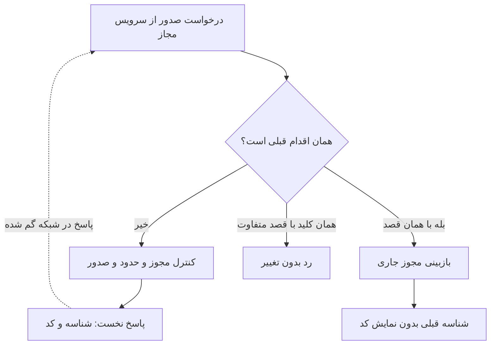

# محصول: یک‌بار نمایش کد

وضعیت: استخراج آموزشی، تأیید مستقل این بسته ندارد.

**مسئله:** مصرف‌کننده ممکن است پاسخ صدور را در شبکه نگیرد و همان درخواست را تکرار کند. نباید کد دوم ساخته یا کد خام دوباره افشا شود.

| شناسه منبع | رفتار |
|---|---|
| OTP/P-09 | نخستین پاسخ صدور کد را یک بار نشان می‌دهد؛ تکرار همان درخواست شناسه قبلی را بدون کد می‌دهد و کد جدید نمی‌سازد |
| OTP/P-02 و P-10 | identity معتبر سرویس و مجوز جاری شرط دسترسی‌اند؛ دانستن شناسه مجوز نمی‌سازد |
| OTP/P-12 | کد خام ذخیره یا ثبت نمی‌شود |
| OTP/OTP-05 | همان کلید با ورودی متفاوت conflict و بدون تغییر است |

UC مربوط، صدور OTP در UC-07 منبع است. بازیگر سرویس داخلی مجاز، input مقصد/کاربرد و هویت همان اقدام، output نخست شناسه و کد و output تکرار شناسه بدون کد است. ارسال پیام با مصرف‌کننده است.

این نمودار فقط شاخهٔ replay را برجسته می‌کند؛ مجوز و سهمیه برای مسیر تازه حذف نمی‌شوند. اگر پاسخ نخست گم شد، replay نباید raw code را بازیابی کند؛ مصرف‌کننده برای صدور تازه تابع حدود فعلی می‌ماند. روش قفل و schema در این تصمیم محصول وجود ندارد.

AC آموزشی: یک صدور موفق و replay با intent یکسان ⇒ همان challenge، بدون کد و بدون اثر صدور دوباره. intent متفاوت ⇒ conflict و state بدون تغییر. نبود پاسخ نخست ⇒ همان قاعدهٔ عدم افشای مجدد برقرار.
