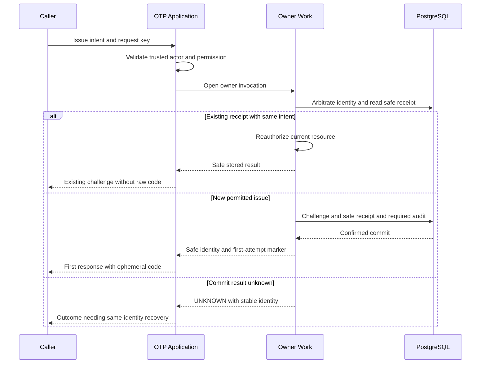

# تغییر آموزشی ماژول OTP در درخواست replay

- targetType: module؛ targetId: otp؛ IMPACT-ID: DEMO-IMP-OTP؛ نوع اثر: direct.
- مسئول فنی در pilot واقعی تعیین می‌شود؛ هیچ انتصاب یا approval در این مثال ساخته نشده است.
- ورودی: [محصول](../../../product.md) و [QA](../../../qa.md)؛ [نگاشت تست](test-mapping.md).

وضعیت: **پیشنهاد آموزشیِ بازبینی‌نشده**. طرح زیر candidate موقت این مثال است؛ سند canonical برای ماژول OTP در Backend ایجاد نشده است. در اجرای واقعی snapshot کامل در بستهٔ درخواست review و پس از G-T در T09 به modules/ منتشر می‌شود؛ این مثال بدون approval به کتابخانه وارد نمی‌شود. هیچ کلاس یا migration ساخته نشده است. طراحی واقعی باید عملیات و policyهای تصمیم‌گرفته‌شده در قرارداد همان پرونده را با مخزن کد هدف تطبیق دهد.

owner پیشنهادی `otp` است؛ Application عملیات Issue را با context سرویس معتبر اجرا می‌کند. کد خام فقط در حافظهٔ attempt نخست می‌ماند و به receipt نمی‌رود. receipt خروجی امنی مانند challenge identity و metadata غیرحساس دارد. replay بعد از authorization جاری فقط همین خروجی امن را بازمی‌گرداند. تعیین دقیق fingerprint حساس، material protection و lifetime در طراحی کامل امنیت/داده لازم است؛ hash سادهٔ داده کم‌دامنه راه‌حل مفروض نیست.

این sequence محل منطقی تعهدهاست؛ raw code نباید داخل result DTO عمومی ذخیره‌پذیر یا log قرار بگیرد. ارسال پس از commit همچنان ممکن است گم شود؛ محصول پذیرفته که replay آن را بازافشا نمی‌کند. wrapperی که raw response را خودکار در receipt cache کند ناسازگار است.

| QA | طراحی evidence | چرا fake کافی نیست؟ |
|---|---|---|
| 01/02 | unit برای output mapping؛ PostgreSQL برای receipt/uniqueness/no second mutation | fake رقابت storage را ثابت نمی‌کند |
| 03/04 | integration با barrier و fault بعد commit | موفقیت callback دلیل commit واقعی نیست |
| 05 | Application auth tests و real receipt replay تحت permission فعلی | receipt نباید revoke را bypass کند |
| 06 | negative leak assertions در receipt، logs و diagnostic boundary | absence در response تنها کافی نیست |

این candidate تا T05/T06/T07 کامل و تصویب نشود ورودی D01 نیست. تکنیک locking و public transport، canonical DTO/errors، grant provisioning و مدل full OTP در این مثال بسته نشده‌اند.
