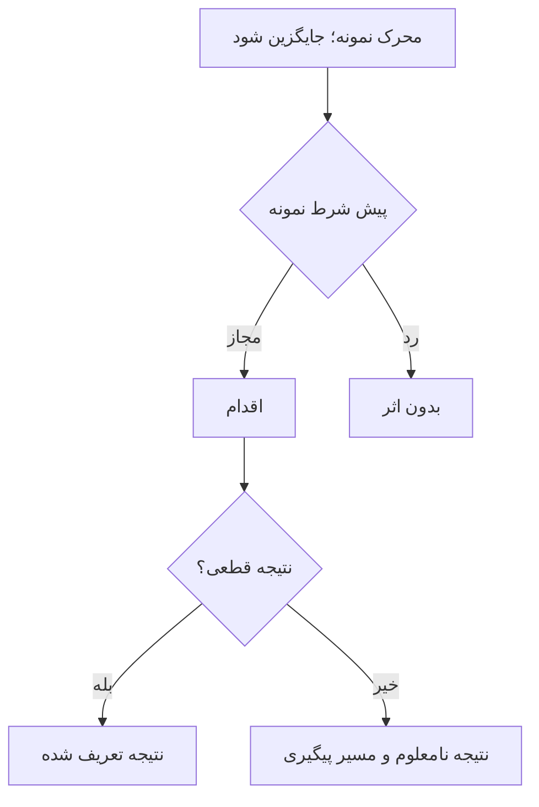

# جریان، وضعیت و دادهٔ مفهومی

> قالب است؛ `{{...}}` را با تصمیم و شاهد واقعیِ غیرحساس جایگزین کنید. وجود این فایل به معنی approval یا اجرای تست نیست.

## زبان و مالکیت

| مفهوم | هویت و ویژگی معنایی | مالک تصمیم | دسترسی | ایجاد/تغییر/پایان عمر | rule |
|---|---|---|---|---|---|
| {{...}} | {{...}} | {{...}} | {{...}} | {{...}} | {{...}} |

مفهوم هویت‌دار محصول الزاماً جدول یا aggregate نیست. نمودار مفهومی برای رابطه ownerها/مفهوم‌ها لازم است؛ دادهٔ ماندگار با ER مفهومی و فیلدهای معنادار نشان داده شود. SQL type، index و lock اینجا تصمیم‌گیری نمی‌شوند.

## جریان FLOW-ID

- UC و ruleها، محرک، بازیگر، پیش‌شرط: {{...}}
- گام‌های واقعی مسیر عادی: {{...}}
- شکست قبل اثر / بعد اثر / نتیجه نامعلوم: {{...}}
- تکرار همان اقدام و اقدام تازه، رقابت، لغو/انقضا: {{...}}
- نتیجه، اثر ممنوع و راه ادامه: {{...}}

برای هر جریان اصلی یک flowchart/stateDiagram واقعی با تمام شاخه‌های متفاوت جایگزین کنید. برای تعامل actor/ماژول/وابستگی sequenceDiagram با مسیر شکست لازم است. این اسکلت فقط آموزش قالب است:

## گذارهای وضعیت

| حالت مبدأ | اقدام/زمان | guard | حالت مقصد | نتیجه به actor | شکست/تکرار | rule/AC |
|---|---|---|---|---|---|---|
| {{...}} | {{...}} | {{...}} | {{...}} | {{...}} | {{...}} | {{...}} |

## دادهٔ لازم

| DATA-ID | چرا نگه می‌داریم؟ | فیلدهای معنایی | حساسیت و داده ممنوع | دسترسی | retention start/مدت/حذف | rule |
|---|---|---|---|---|---|---|
| {{...}} | {{...}} | {{...}} | {{...}} | {{...}} | {{...}} | {{...}} |

برای هر مفهوم شرح مستقل دلیل، چرخه عمر و رابطه بنویسید. اگر ماندگاری لازم نیست «در این نسخه ندارد» و دلیل بدهید؛ ER ساختگی نسازید. ابهام را کنار همان field/branch با ID تصمیم باز نشان دهید.
