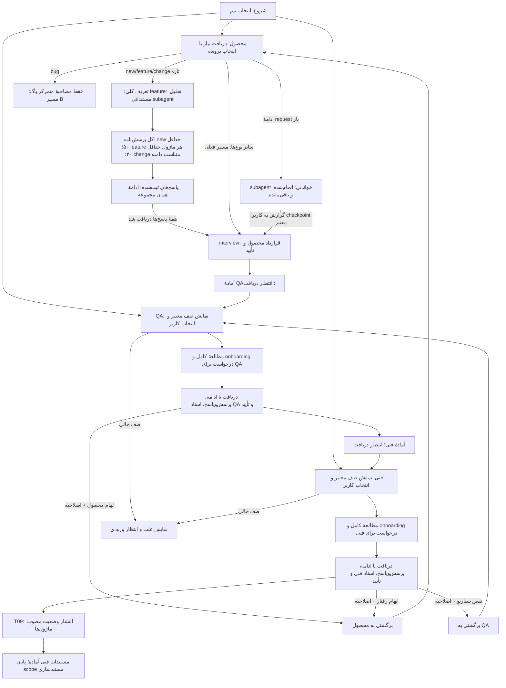

# شروع کار با انتخاب تیم

این راهنما نقطهٔ ورود گفت‌وگوهای کاری همین پروژه است. nodeهای [graph](graph.json) اجرای یک پرونده را تعریف می‌کنند؛ انتخاب تیم و پرونده پیش از آن انجام می‌شود و gate جدیدی نمی‌سازد. درخواست تغییر خودِ workflow مانند همین طراحی، پروندهٔ محصول واقعی محسوب نمی‌شود.

## گام اول: تیم

در شروع بپرس: **«از کدام تیم هستی؟ محصول / QA / فنی»**. پاسخ فارسی یا `product`، `qa`، `tech` معتبر است. اگر کاربر از ابتدا تیمش را گفته، همان پاسخ را بگیر؛ در ادامهٔ همان گفت‌وگو دوباره نپرس. تغییر صریح تیم، صف تیم جدید را نمایش می‌دهد و وضعیت پرونده‌ها را به‌تنهایی عوض نمی‌کند.

تیم، مسیر کمک AI را تعیین می‌کند. هویت و انتصاب انسان برای تصمیم‌های انسانی جداست: «QA هستم» به‌تنهایی approval محصول یا دریافت نسخهٔ مشخص نیست. برای دیدن صف، نقش‌های همهٔ تیم‌ها را از کاربر نخواه؛ هنگام تحویل/تأیید، نقش لازم همان پرونده را تکمیل کن.

انتخاب تیم، محدودهٔ نوشتن را طبق [مالکیت فایل‌ها](../docs/08-team-file-ownership.md) تعیین می‌کند. تیم انتخاب‌شده فایل تیم دیگر را حتی برای اصلاح نگارشی تغییر نمی‌دهد؛ تغییر صریح تیم باید با مرجع ثبت و محدودهٔ نوشتن از نو بررسی شود.

## گام دوم: شروع متناسب با تیم

| تیم | آنچه ابتدا به کاربر نشان می‌دهیم | ادامه پس از دریافت ورودی |
|---|---|---|
| محصول | «نیازت را بگو؛ چه کاری باید انجام دهیم؟»؛ همراه پرونده‌های محصولِ در حال کار و برگشتی، اگر وجود دارند | نیاز تازه: I01 و routing؛ new/feature/change ابتدا پرسش‌نامهٔ کامل و پاسخ‌ها، سپس interview؛ bug فقط مصاحبه. نیاز گفته‌شده دوباره پرسیده نشود. برای پروندهٔ موجود، ابتدا گزارش subagent از انجام‌شده‌ها و باقی‌مانده‌ها، سپس ادامهٔ checkpoint معتبر. |
| QA | جدول پرونده‌های آمادهٔ QA، سپس موارد در حال کار و برگشتی/مسدود همین تیم؛ «روی کدام پرونده می‌خواهی کار کنی؟» | پس از انتخاب، مطالعهٔ کامل اسناد و onboarding درخواست؛ سپس Q01 برای دریافت واقعی یا ادامهٔ node ثبت‌شده و معتبر. |
| فنی | جدول پرونده‌های دارای محصول و QA کامل و معتبر، سپس موارد در حال کار و برگشتی/مسدود همین تیم؛ «مستندات فنی کدام پرونده را آماده کنیم؟» | پس از انتخاب، مطالعهٔ کامل اسناد و onboarding درخواست؛ سپس T01 یا checkpoint معتبر و تهیهٔ مستندات تا تحویل. |

برای هر ردیف: شناسه، عنوان، ماژول‌های متأثر، وضعیت، تیم/مسئول فعلی، نسخه‌های مبنا، اقدام بعدی، علت برگشت یا مانع و لینک سند اصلی را نشان بده. پاسخ با شناسه، شمارهٔ ردیف یا عنوان یکتا پذیرفته است؛ انتخاب مبهم نیاز به رفع همان ابهام دارد. حتی اگر یک مورد هست، انتخاب کاربر لازم است؛ اگر قبلاً پرونده را صریح انتخاب کرده، تأیید تکراری نخواه.

خواندن صف و انتخاب کارت، دریافت یا تأیید نسخه نیست. Q01 و T01 باید پاسخ واقعی گیرنده را ثبت کنند؛ فقط اگر انتخاب کاربر صریحاً دریافت همان نسخه را نیز پوشش دهد، همان پیام می‌تواند مرجع receipt باشد.

## آماده‌بودن و صف خالی

- **آمادهٔ QA:** G-P معتبر برای نسخه و scope فعلی، manifest و فایل‌ها قابل دسترسی و منطبق، handover محصول کامل، مانع یا اصلاحیهٔ باز مؤثر ندارد؛ nextNode برابر Q01 است.
- **آمادهٔ فنی:** G-P و G-Q هر دو معتبر، parent محصولِ QA همان نسخهٔ جاری، handoverهای محصول و QA کامل و قابل دسترسی، مانع یا اصلاحیهٔ باز مؤثر ندارد؛ nextNode برابر T01 است.
- **ادامهٔ کار:** قبلاً دریافت معتبر دارد و checkpoint متعلق به تیم انتخاب‌شده است؛ ورودی‌ها دوباره از نظر اعتبار بررسی شوند. receipt معتبر دوباره گرفته نمی‌شود و پاسخ‌های قبلی تکرار نمی‌شوند.
- **برگشتی یا مسدود:** در بخش جدا با دلیل و صاحب اقدام نمایش داده شود؛ عنوان «آمادهٔ مرحلهٔ بعد» نگیرد. صرف وجود فایل، نام پوشه یا برچسب board، gate را ثابت نمی‌کند.
- **صف خالی:** صریح بگو «فعلاً پروندهٔ آمادهٔ QA/فنی نداریم». اگر موارد متوقف یا برگشتی وجود دارند، همان‌ها و علتشان را نشان بده؛ هیچ مثال آموزشی یا مستندات محصول پیشین تأییدنشده‌ای به‌عنوان کار آماده وارد نکن. منتظر انتخاب/ورودی بمان؛ به تیم دیگری خودکار نرو.

Coordinator پیش از نمایش، [برد](../requests/board.json) را با [تاریخچهٔ tracking](../templates/shared/tracking.md)، journal، handover، manifest، approval، receipt و change-impact پرونده‌های واقعی تطبیق می‌دهد؛ جدول قابل نمایش را از cards همین JSON می‌سازد. [قرارداد JSON](../docs/07-board-json.md) شکل فیلدها و ارجاع‌ها را مشخص می‌کند. مرتب‌سازی پیشنهادی: برگشتی‌ها، ادامهٔ کار، آماده‌های تازه؛ اولویت انسانی ثبت‌شده مقدم است. این ترتیب تصمیم محصول تازه نیست.

## گام سوم: ادامه و تحویل

پیش از ادامه، [قرارداد مرور و onboarding](../docs/12-request-onboarding.md) را اجرا کن. در ادامهٔ محصول، یک subagent فقط خواندنی مستندات و سوابق را می‌خواند؛ agent اصلی گزارش وضعیت، کار انجام‌شده، کار باقی‌مانده و اقدام بعدی را به کاربر نشان می‌دهد. در QA و فنی، پس از انتخاب در ورود نخست، ادامه و دریافت مجدد، همهٔ اسناد موجود و مراجع لازم بررسی و درخواست با جزئیات رفتار/پذیرش و زمینهٔ همان تیم توضیح داده می‌شود. نقص دسترسی یا نسخهٔ stale باید در گزارش معلوم باشد. این مرور پیش از دریافت Q01/T01 است؛ خودش receipt یا تأیید نیست و تأیید دوبارهٔ گزارش لازم ندارد.

پس از انتخاب، اعتبار نسخه‌ها، node، scope اختیار و نبود writer متعارض را دوباره بررسی کن. اگر از زمان نمایش صف ورودی عوض شده، انتخاب قدیمی مجوز ادامه نیست: علت را نشان بده و پرونده را برای تعیین اثر متوقف کن. checkpoint معتبر طبق [قرارداد node](00-node-contract.md) ادامه می‌یابد؛ I01 فقط ورودی درخواست تازه است. مسیر باگ از B nodeها و نقش ثبت‌شدهٔ همان node ادامه می‌یابد؛ برای آن مسیر عادی را از اول تکرار نکن.

تحویل در P08 یا Q06 صف تیم بعدی را به‌روز می‌کند و جلسه در مرز تیم فعلی منتظر گیرنده می‌ماند. پیوند graph به Q01/T01 مقصد بعدی پرونده است، نه مجوز AI برای پاسخ‌دادن به جای گیرنده. در صورت انتخاب صریح تیم بعد و داشتن نقش لازم، همان گفت‌وگو می‌تواند ادامه یابد.

خروجی معمول انتخاب فنی، مستندات فنی و handover معتبر است. T07 تأیید طراحی را از اختیار پیاده‌سازی جدا ثبت می‌کند؛ T09 نسخهٔ کامل مصوب ماژول‌ها را منتشر می‌کند و سپس T08 برای agent product-workflow همیشه به HOLD می‌رود و `resumeNode=D01` را برای آینده نگه می‌دارد. اجرای D01 مربوط به گیرندهٔ مستقل Backend است؛ agent این workflow هیچ فایل/ابزار Backend را تغییر/اجرا نمی‌کند. اتصال از project/backend.json در ../BackendName خوانده و نام موجود دوباره پرسیده نمی‌شود.

هر سه تیم طبق [چرخهٔ مستندسازی](../docs/11-documentation-cycle.md) با AI گفت‌وگو می‌کنند: محصول P02/P03، QA در صورت سؤال مؤثر Q07/Q08 و فنی T10/T11. پاسخ جزئی و ادامه پس از وقفه از همان batch ثبت‌شده است. پاسخ مصاحبه، approval نهایی بسته یا receipt محسوب نمی‌شود.

در new/feature/change تازه، پیش از P02/P03 [پرسش‌نامهٔ اولیه](../docs/13-product-questionnaire.md) در P09/P10 اجرا می‌شود؛ feature ابتدا P11 با subagent فقط خواندنی برای فهرست ماژول‌ها دارد. پرسش‌نامه و پاسخ‌های جزئی داخل request حفظ می‌شوند؛ ادامه از P10، مجموعه را از اول یا به interview تبدیل نمی‌کند.

## بازگشت با اصلاحیه

هر برگشت در [tracking](../templates/shared/tracking.md) و change-impact ثبت می‌شود: از کدام تیم/node و نسخه، به کدام تیم/node، دلیل، بخش‌ها/شناسه‌های متأثر، اصلاح مورد انتظار و مرجع بازخورد. نوع علت مسیر را تعیین می‌کند: نقص متن محصول به P04، تصمیم رفتاری به C01/C02، نقص QA با رفتار ثابت به Q03، نقص طراحی به T04؛ مشکل دسترسی بسته به P08 یا Q06. پیش از اجرا مقصد باید با node گزارش‌دهنده یا C01 سازگار باشد.

کارت برای صاحب اصلاح در ستون «برگشتی» دیده می‌شود؛ کار وابسته در تیم گزارش‌دهنده تا رفع علت متوقف می‌ماند. نسخه‌های قبلی و تأییدها حفظ می‌شوند، وابستگی‌های متأثر stale می‌شوند و پس از اصلاح review/approval نسخهٔ تازه و تحویل دوباره انجام می‌شود. برای رفع صرف مشکل دسترسی روی bytes ثابت، approval دوباره لازم نیست. وقتی معیار اصلاح و gateها کامل شدند، اصلاحیه «آمادهٔ دریافت مجدد» می‌شود و در بخش برگشتیِ تیم گیرنده قابل انتخاب است؛ این اصلاحیهٔ رفع‌شده مانع Q01/T01 نیست. پایان اصلاحیه با دریافت دوبارهٔ بستهٔ معتبر ثبت می‌شود؛ صرف نوشتن «رفع شد» کافی نیست.

[قواعد وضعیت و نسخه](../docs/02-state-and-versioning.md) · [شرایط gateها](../docs/04-gates.md) · [سناریوهای بازبینی ورودی و برد](../examples/team-entry.md)

پس از نگارش بستهٔ کامل، [بازبینی مستندات](../docs/14-document-review.md) در هر سه تیم الزامی است: P05/Q04/T06 بازبینی subagent بدون اجازهٔ تکراری؛ پس از رفع یافته‌ها، P12/Q09/T12 تأیید reviewer انسانی؛ سپس gate نهایی. معرفی reviewer مجهول پس از آماده‌شدن گزارش انجام می‌شود.
