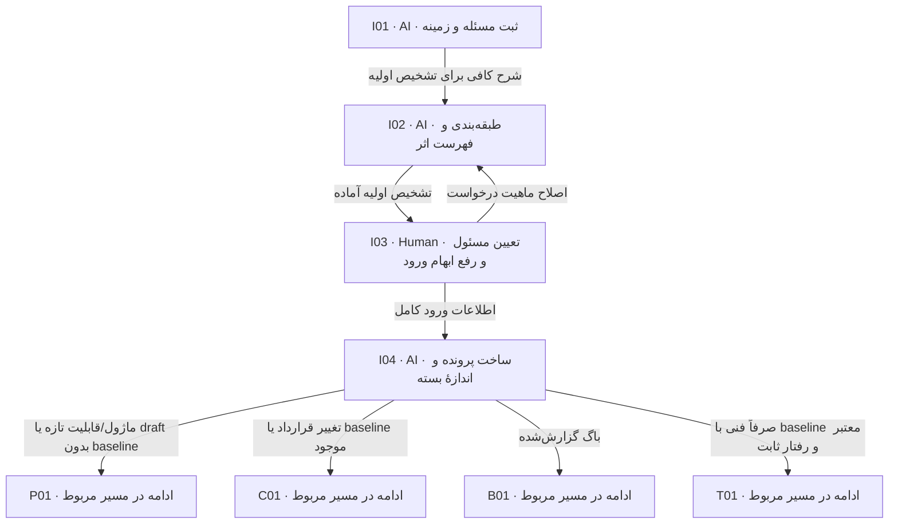

# ورود درخواست و تشخیص مسیر

ورودی درخواست تازه پس از انتخاب تیم محصول و دریافت شرح آزاد است. QA و فنی برای پرونده‌های موجود از صف تیم خود وارد Q01/T01 یا checkpoint می‌شوند. درخواست چندماژولی یک پرونده و مالکیت روشن دارد؛ تشخیص AI تأیید محصول نیست.

> کارت‌ها از [graph.json](graph.json) تولید می‌شوند. توقف، انتظار و retry مشترک در [قرارداد node](00-node-contract.md) اعمال می‌شود.

## I01 — ثبت مسئله و زمینه

**مجری:** AI — Coordinator

**ورودی:** تیم محصول انتخاب‌شده و شرح موجود کاربر، پیوند اسناد/نمونه‌ها و دسترسی read-only مخازن

**کار دقیق:** شرح را پالایش و ثبت کن؛ outcome، actor، درد فعلی و non-goal را خلاصه کن. شرحی را که وجود دارد دوباره نخواه. دادهٔ حساس را حذف و دلیل redaction را ثبت کن. اگر شرحی وجود ندارد ابتدا بپرس «نیازت را بگو؛ چه کاری باید انجام دهیم؟». این node برای درخواست تازه است؛ پروندهٔ انتخاب‌شده از صف را دوباره ثبت نکن. برای ماژول تازه ابتدا تعریف کلی شامل چیست، چه می‌کند، برای چه کسی، هدف و نتیجهٔ مطلوب را از شرح موجود بگیر یا همان بخش نامعلوم را بپرس؛ این تعریف پیش از طراحی پرسش‌نامه است.

**خروجی:** request.md با request-id، source references و خلاصهٔ قابل اصلاح

**شرط پایان:** درخواست خام و برداشت AI جدا و قابل ردیابی‌اند.

| نتیجه | node بعدی |
|---|---|
| شرح کافی برای تشخیص اولیه | [I02](01-intake.md#i02) |

## I02 — طبقه‌بندی و فهرست اثر

**مجری:** AI — Coordinator

**ورودی:** request و قراردادهای موجود ماژول‌های محتمل؛ قواعد routing در docs/09-product-authoring.md همین مخزن

**کار دقیق:** نوع اصلی new/feature/change/bug/technical-only را تعیین کن؛ همهٔ ماژول‌های متأثر و دلیل هرکدام را بنویس. برای routing محصول گفتهٔ کاربر دربارهٔ ادغام را کافی بدان؛ در نبود آن سؤال مستقیم را برای I03 ثبت کن. نوع feature با داشتن baseline به change تغییر نام نمی‌دهد؛ routing نسخه و نوع نیاز جدا هستند. سهمیه/مسیر پرسش‌نامه طبق docs/13-product-questionnaire.md است؛ change تازه پرسش‌نامهٔ متناسب با دامنه پیش از interview دارد؛ technical-only فقط interview فنی، بدون پرسش‌نامهٔ محصول دارد.

**خروجی:** routing و جدول module/behavior/implementation-statement/source فهرست اولیهٔ اثر ماژولی؛ نقشهٔ فنی نهایی در T02 ساخته می‌شود.

**شرط پایان:** مسیر اصلی و اثرهای فرعی مشخص؛ unknownها با سؤال معین‌اند.

| نتیجه | node بعدی |
|---|---|
| تشخیص اولیه آماده | [I03](01-intake.md#i03) |

## I03 — تعیین مسئول و رفع ابهام ورود

**مجری:** Human — درخواست‌کننده با نمایندهٔ محصول

**ورودی:** خلاصهٔ I02، نقش‌های لازم و فقط ابهام‌های مؤثر ورود

**کار دقیق:** مسئول Product، QA، Tech و درخواست‌کننده را تعیین یا به مرجع انتصاب موجود ارجاع بده. اگر وضعیت پیاده‌سازی گفته نشده، همان رفتار را مشخص کن. تعارض routing را اصلاح کن؛ اطلاعات قبلی تکرار نمی‌شود. مسئول فنی ماژول‌ها می‌تواند در T02 پیشنهاد و پیش از G-T توسط Tech lead تعیین شود؛ برای نام‌گذاری زودهنگام ماژول فنی سؤال محصول نساز. نقش‌های هنوز منصوب‌نشده را با وضعیت نامشخص ثبت کن؛ تعیین QA/Tech آینده مانع نگارش محصول نیست، ولی پیش از node/gate انسانی مربوط باید انتساب واقعی کامل شود.

**خروجی:** تصمیم/انتصاب دارای مرجع و scope؛ unresolvedها با owner

**شرط پایان:** درخواست‌کننده و مسئول فعلی محصول با مرجع مشخص‌اند و مسیر ادامه معلوم است؛ انتصاب نقش‌های مراحل آینده در صورت نامشخص‌بودن، پیش‌نیاز باز همان مرحله می‌ماند.

| نتیجه | node بعدی |
|---|---|
| اطلاعات ورود کامل | [I04](01-intake.md#i04) |
| اصلاح ماهیت درخواست | [I02](01-intake.md#i02) |

## I04 — ساخت پرونده و اندازهٔ بسته

**مجری:** AI — Coordinator

**ورودی:** routing پذیرفته‌شده، نقش‌ها و منابع

**کار دقیق:** از قالب‌های مرتبط پرونده بساز؛ scope کوچک قابل پذیرش و applicability با دلیل تعیین کن. technical-only فقط با baseline محصول/QA معتبر و impact بدون تغییر observable مجاز است.

**خروجی:** applicability.md، index منابع، journal آغاز و مسیر انتخابی کارت JSON با وضعیت و تیم مسئول در requests/board.json؛ tracking.md با سابقهٔ آغاز.

**شرط پایان:** هر سند لازم owner و مقصد دارد؛ هیچ baseline قدیمی overwrite نشده.

| نتیجه | node بعدی |
|---|---|
| ماژول/قابلیت تازه یا draft بدون baseline | [P01](02-product.md#p01) |
| تغییر قرارداد یا baseline موجود | [C01](07-change-and-bug.md#c01) |
| باگ گزارش‌شده | [B01](07-change-and-bug.md#b01) |
| صرفاً فنی با baseline معتبر و رفتار ثابت | [T01](04-technical.md#t01) |
