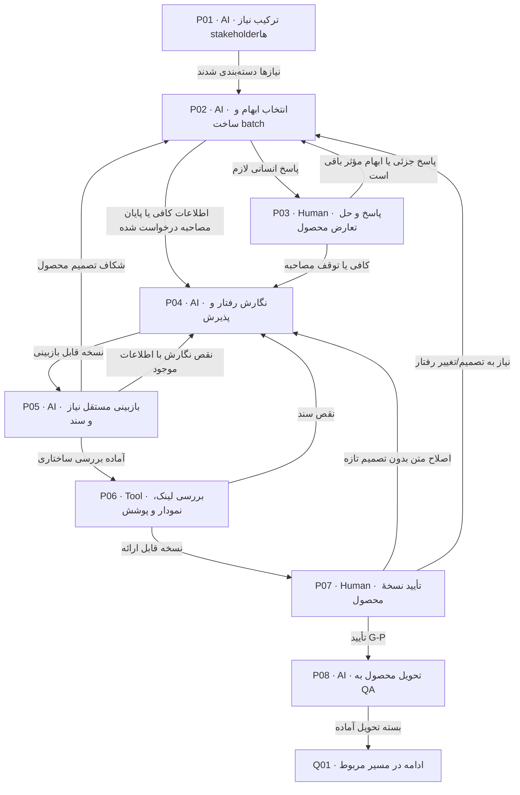

# جمع‌آوری نیاز، مصاحبه و قرارداد محصول

Product نیاز stakeholderها را به AI می‌دهد؛ پیشنهاد AI تا پاسخ صریح تصمیم نیست. کیفیت شرح جریان و پذیرش مهم‌تر از تعداد فایل است.

> کارت‌ها از [graph.json](graph.json) تولید می‌شوند. توقف، انتظار و retry مشترک در [قرارداد node](00-node-contract.md) اعمال می‌شود.

## P01 — ترکیب نیاز stakeholderها

**مجری:** AI — Product interviewer با ورودی Product owner

**ورودی:** request، نیازهای جمع‌آوری‌شده، قراردادها و تصمیم‌های قبلی؛ راهنمای محصول داخلی و قالب‌های product همین مخزن

**کار دقیق:** منبع، هدف و محدودیت هر stakeholder را ثبت کن؛ اشتراک و تعارض را مشخص کن. stakeholder غایب را با نظر AI پر نکن. Product owner مسئول جمع‌آوری پاسخ آن منبع است.

**خروجی:** stakeholder matrix، glossary اولیه، تصمیم روشن/پیشنهاد/باز

**شرط پایان:** هر نیاز منبع دارد و تعارض‌ها owner انسانی دارند.

| نتیجه | node بعدی |
|---|---|
| نیازها دسته‌بندی شدند | [P02](02-product.md#p02) |

## P02 — انتخاب ابهام و ساخت batch

**مجری:** AI — Product interviewer

**ورودی:** decisions، پاسخ‌های قبلی، draft و open items

**کار دقیق:** فقط ابهام مؤثر بر scope فعلی انتخاب کن. اگر سؤال بی‌پاسخ از batch قبلی هست، فقط همان شماره‌ها؛ وگرنه تا پنج سؤال با چهار گزینهٔ واقعی و پنجم پیشنهاد شما، توصیه و دلیل. اگر مورد مسدودکننده نیست سؤال تازه نساز.

**خروجی:** یک پیام کامل سؤال‌ها یا readiness note؛ ثبت متن در interview.md

**شرط پایان:** گزینه‌ها مستقل، سؤال تک‌تصمیمی و توصیه از تصمیم جداست.

| نتیجه | node بعدی |
|---|---|
| پاسخ انسانی لازم | [P03](02-product.md#p03) |
| اطلاعات کافی یا پایان مصاحبه درخواست شده | [P04](02-product.md#p04) |

## P03 — پاسخ و حل تعارض محصول

**مجری:** Human — درخواست‌کننده / Product owner در حدود نقش

**ورودی:** همان batch کامل و منبع تعارض

**کار دقیق:** پاسخ شماره‌ای یا آزاد بده؛ می‌توانی فقط برخی را پاسخ دهی یا مصاحبه را متوقف کنی. تصمیم متعارض را صریح اصلاح کن. AI متن پالایش‌شده و برداشت را ثبت می‌کند و تصمیم قبلی را superseded می‌کند، نه حذف.

**خروجی:** پاسخ خام امن، decision references و وضعیت هر سؤال

**شرط پایان:** هیچ سؤال بی‌پاسخ با توصیه AI پر نشده؛ تأیید نهایی همچنان با درخواست‌کننده است.

| نتیجه | node بعدی |
|---|---|
| پاسخ جزئی یا ابهام مؤثر باقی است | [P02](02-product.md#p02) |
| کافی یا توقف مصاحبه | [P04](02-product.md#p04) |

## P04 — نگارش رفتار و پذیرش

**مجری:** AI — Product writer

**ورودی:** تصمیم‌های معتبر و open items، قالب product

**کار دقیق:** contract اصلی را بنویس و ruleها را به جریان/UC/operation/AC وصل کن. lifecycle، خطا، تکرار، رقابت، داده/دسترسی/عمر و وابستگی را با نمودار واقعی توضیح بده. جزئیات SQL/قفل به candidate فنی می‌روند. بخش روشن را کامل کن حتی اگر شاخهٔ دیگری باز است. handover همان مرحله را نیز پیش از review به‌صورت draft کامل بنویس تا همراه بقیه اسناد در manifest نامزد تأیید باشد. فقط فایل‌های محصول را بنویس؛ پیشنهاد فنی صرفاً در یادداشت همان محصول ثبت و برای فنی ارجاع شود. دادهٔ traceability را به Coordinator بده تا فایل مشترک را ثبت کند. عمق قرارداد، جریان/داده، UC و پذیرش طبق docs/09-product-authoring.md کنترل شود؛ مثال آموزشی محلی معیار توضیح است، نه منبع الزام پرونده.

**خروجی:** product contract، flows/data/operations لازم، AC، traceability

**شرط پایان:** هر رفتار الزام‌آور در قرارداد اصلی دیده می‌شود؛ در ضمیمه قاعدهٔ پنهان نیست.

| نتیجه | node بعدی |
|---|---|
| نسخه قابل بازبینی | [P05](02-product.md#p05) |

## P05 — بازبینی مستقل نیاز و سند

**مجری:** AI — Reviewer مستقل یا reviewer انسانی جایگزین

**ورودی:** درخواست و مصاحبه، تمام اسناد product، منابع و scope

**کار دقیق:** هر rule را به پاسخ/قرارداد معتبر وصل کن؛ ناسازگاری عدد/زمان/مالکیت و رفتار مخفی در ضمیمه را پیدا کن. عمق را با OTP مقایسه کن، نه قوانینش را. یافته با محل، شاهد، اثر و owner بده.

**خروجی:** review product با blocker/major/minor و مقصد اصلاح

**شرط پایان:** همهٔ یافته‌های مسدودکننده بسته یا صریح برای تصمیم ارجاع شده‌اند.

| نتیجه | node بعدی |
|---|---|
| شکاف تصمیم محصول | [P02](02-product.md#p02) |
| نقص نگارش با اطلاعات موجود | [P04](02-product.md#p04) |
| آماده بررسی ساختاری | [P06](02-product.md#p06) |

## P06 — بررسی لینک، نمودار و پوشش

**مجری:** Tool — Check runner با تفسیر Coordinator

**ورودی:** نسخهٔ ثابت draft محصول و traceability

**کار دقیق:** لینک‌های محلی، syntax Mermaid، IDهای تکراری/بی‌مرجع، placeholder در سند نهایی و وجود خروجی لازم را بررسی کن؛ معنای نمودار و تعارض با متن جدا review شود. نام ابزار/نسخه/نتیجه را ثبت کن.

**خروجی:** validation report و manifest immutable candidate شامل handover محصول؛ approval بیرون manifest

**شرط پایان:** خطای ساختاری صفر؛ open item مؤثر پنهان نشده و validation ادعای approval ندارد.

| نتیجه | node بعدی |
|---|---|
| نقص سند | [P04](02-product.md#p04) |
| نسخه قابل ارائه | [P07](02-product.md#p07) |

## P07 — تأیید نسخهٔ محصول

**مجری:** Human — همان درخواست‌کننده

**ورودی:** قرارداد اصلی، خلاصه تصمیم و موارد باز، review، manifest candidate

**کار دقیق:** نسخهٔ مشخص را approve یا با دلیل رد کن؛ کاهش scope باید صریح باشد. open item مؤثر در scope مانع approve است. AI فقط پاسخ و مرجع انسانی را در approval جدا ثبت می‌کند.

**خروجی:** G-P approval مرتبط با digest manifest یا feedback

**شرط پایان:** تصمیم صریح همان درخواست‌کننده روی همان bytes وجود دارد.

| نتیجه | node بعدی |
|---|---|
| تأیید G-P | [P08](02-product.md#p08) |
| اصلاح متن بدون تصمیم تازه | [P04](02-product.md#p04) |
| نیاز به تصمیم/تغییر رفتار | [P02](02-product.md#p02) |

## P08 — تحویل محصول به QA

**مجری:** AI — Coordinator

**ورودی:** G-P معتبر، product bundle و منابع

**کار دقیق:** manifest را freeze و handover مستقل تهیه کن: scope، read order، rule/UC/AC، dependency، out-of-scope و انتظار از QA. approval بیرون manifest بماند. دسترسی QA را فراهم کن؛ ارسال بیرونی خودکار نیست. handover و manifest باید همان bytes ارائه‌شده پیش از approval باشند؛ در این node محتوای بسته تغییر نمی‌کند و فقط دسترسی/receipt/journal آماده می‌شود. هر اصلاح محتوا به review و approval نسخه تازه برمی‌گردد. پس از کنترل آمادگی، tracking و برد را به صف آمادهٔ QA به‌روز کن؛ nextNode=Q01 است. تا انتخاب/دریافت واقعی تیم بعد منتظر بمان؛ انتقال کارت دریافت انسانی نیست.

**خروجی:** product/handover.md، baseline P، approval ref و receipt pending

**شرط پایان:** hashها معتبر و بسته برای گیرنده قابل خواندن است.

| نتیجه | node بعدی |
|---|---|
| بسته تحویل آماده | [Q01](03-qa.md#q01) |
