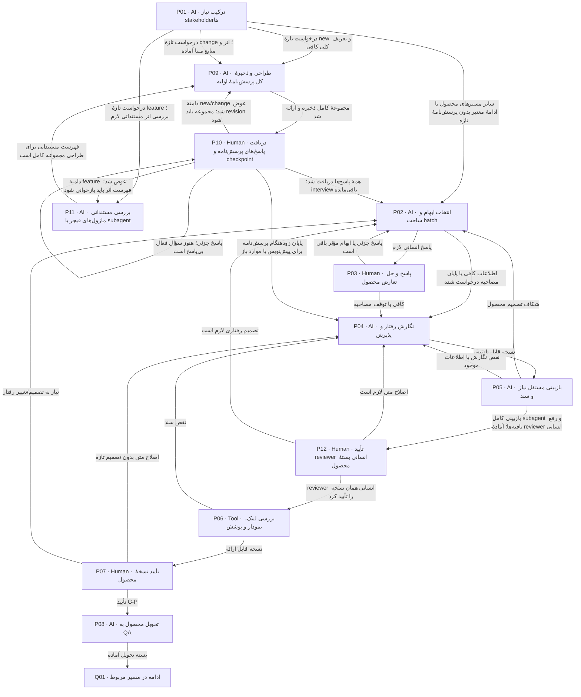

# جمع‌آوری نیاز، مصاحبه و قرارداد محصول

شرح کلی، پرسش‌نامهٔ کامل ماژول تازه، فیچر یا change، دریافت پاسخ‌ها، سپس interview هدفمند و قرارداد محصول؛ باگ و technical-only فقط interview مربوط دارند.

> کارت‌ها از [graph.json](graph.json) تولید می‌شوند. توقف، انتظار و retry مشترک در [قرارداد node](00-node-contract.md) اعمال می‌شود.

## P01 — ترکیب نیاز stakeholderها

**مجری:** AI — Product interviewer با ورودی Product owner

**ورودی:** request، نیازهای جمع‌آوری‌شده، قراردادها و تصمیم‌های قبلی؛ راهنمای محصول داخلی و قالب‌های product همین مخزن

**کار دقیق:** منبع، هدف و محدودیت هر stakeholder را ثبت کن؛ اشتراک و تعارض را مشخص کن. stakeholder غایب را با نظر AI پر نکن. Product owner مسئول جمع‌آوری پاسخ آن منبع است. برای new تعریف کلی و برای feature شرح فیچر را کنترل کن؛ قبل از interview مسیر docs/13-product-questionnaire.md را انتخاب کن. پروندهٔ جاری یا اصلاحیه پرسش‌نامهٔ کامل تازه نمی‌گیرد.

**خروجی:** stakeholder matrix، glossary اولیه، تصمیم روشن/پیشنهاد/باز

**شرط پایان:** هر نیاز منبع دارد و تعارض‌ها owner انسانی دارند.

| نتیجه | node بعدی |
|---|---|
| درخواست تازهٔ new و تعریف کلی کافی | [P09](02-product.md#p09) |
| درخواست تازهٔ change؛ اثر و منابع مبنا آماده | [P09](02-product.md#p09) |
| درخواست تازهٔ feature؛ بررسی اثر مستنداتی لازم | [P11](02-product.md#p11) |
| سایر مسیرهای محصول یا ادامهٔ معتبر بدون پرسش‌نامهٔ تازه | [P02](02-product.md#p02) |

## P02 — انتخاب ابهام و ساخت batch

**مجری:** AI — Product interviewer

**ورودی:** decisions، پاسخ‌های قبلی، draft و open items؛ پرسش‌نامهٔ کامل و پاسخ‌های P10 در new/feature/change و question-id/revision/answer-idهای آن

**کار دقیق:** برای new/feature/change تازه، تکمیل پاسخ‌های پرسش‌نامه طبق docs/13-product-questionnaire.md پیش‌شرط است؛ interview فقط follow-up، تعارض و ابهام باقی‌مانده را می‌پرسد و سؤال پاسخ‌داده‌شده تکرار نمی‌شود. فقط ابهام مؤثر بر scope فعلی انتخاب کن. اگر سؤال بی‌پاسخ از batch قبلی هست، فقط همان شماره‌ها؛ وگرنه تا پنج سؤال با چهار گزینهٔ واقعی و پنجم پیشنهاد شما، توصیه و دلیل. اگر مورد مسدودکننده نیست سؤال تازه نساز.

**خروجی:** یک پیام کامل سؤال‌ها یا readiness note؛ ثبت متن در interview.md

**شرط پایان:** گزینه‌ها مستقل، سؤال تک‌تصمیمی و توصیه از تصمیم جداست.

| نتیجه | node بعدی |
|---|---|
| پاسخ انسانی لازم | [P03](02-product.md#p03) |
| اطلاعات کافی یا پایان مصاحبه درخواست شده | [P04](02-product.md#p04) |

## P03 — پاسخ و حل تعارض محصول

**مجری:** Human — درخواست‌کننده / Product owner در حدود نقش

**ورودی:** همان batch کامل و منبع تعارض

**کار دقیق:** پاسخ شماره‌ای یا آزاد بده؛ می‌توانی فقط برخی را پاسخ دهی یا مصاحبه را متوقف کنی. تصمیم متعارض را صریح اصلاح کن. AI متن پالایش‌شده و برداشت را ثبت می‌کند و تصمیم قبلی را superseded می‌کند، نه حذف.

**خروجی:** پاسخ خام امن، decision references و وضعیت هر سؤال

**شرط پایان:** هیچ سؤال بی‌پاسخ با توصیه AI پر نشده؛ تأیید نهایی همچنان با درخواست‌کننده است.

| نتیجه | node بعدی |
|---|---|
| پاسخ جزئی یا ابهام مؤثر باقی است | [P02](02-product.md#p02) |
| کافی یا توقف مصاحبه | [P04](02-product.md#p04) |

## P04 — نگارش رفتار و پذیرش

**مجری:** AI — Product writer

**ورودی:** تصمیم‌های معتبر و open items، قالب product

**کار دقیق:** contract اصلی را بنویس و ruleها را به جریان/UC/operation/AC وصل کن. lifecycle، خطا، تکرار، رقابت، داده/دسترسی/عمر و وابستگی را با نمودار واقعی توضیح بده. جزئیات SQL/قفل به candidate فنی می‌روند. بخش روشن را کامل کن حتی اگر شاخهٔ دیگری باز است. handover همان مرحله را نیز پیش از review به‌صورت draft کامل بنویس تا همراه بقیه اسناد در manifest نامزد تأیید باشد. فقط فایل‌های محصول را بنویس؛ پیشنهاد فنی صرفاً در یادداشت همان محصول ثبت و برای فنی ارجاع شود. دادهٔ traceability را به Coordinator بده تا فایل مشترک را ثبت کند. عمق قرارداد، جریان/داده، UC و پذیرش طبق docs/09-product-authoring.md کنترل شود؛ مثال آموزشی محلی معیار توضیح است، نه منبع الزام پرونده.

**خروجی:** product contract، flows/data/operations لازم، AC، traceability

**شرط پایان:** هر رفتار الزام‌آور در قرارداد اصلی دیده می‌شود؛ در ضمیمه قاعدهٔ پنهان نیست.

| نتیجه | node بعدی |
|---|---|
| نسخه قابل بازبینی | [P05](02-product.md#p05) |

## P05 — بازبینی مستقل نیاز و سند

**مجری:** AI — Subagent reviewer مستقل محصول؛ ثبت گزارش توسط Coordinator

**ورودی:** درخواست و مصاحبه، تمام اسناد product، منابع و scope؛ پرسش‌نامه و history/پاسخ‌ها و feature-impact در صورت الزام

**کار دقیق:** طبق docs/14-document-review.md بدون درخواست اجازهٔ تکراری، یک subagent مستقل از نویسنده برای بازبینی کامل همین بسته اجرا کن؛ مأموریت فقط خواندنی، تمام اسناد/مراجع/نسخه‌ها و دامنهٔ review را بده. هویت و استقلال بازبین، منابع/digest، حوزهٔ بررسی‌شده/نشده و یافته‌ها ثبت شوند. خود بازبین فایل یا کنترل‌فایل نمی‌نویسد؛ Coordinator گزارش را در reviews ثبت و اصلاح به تیم مالک ارجاع می‌شود. نبود قابلیت/اختیار واقعی محیط، blocked است و با reviewer انسانی جایگزین نمی‌شود. هر rule را به پاسخ/قرارداد معتبر وصل کن؛ ناسازگاری عدد/زمان/مالکیت و رفتار مخفی در ضمیمه را پیدا کن. عمق را با OTP مقایسه کن، نه قوانینش را. یافته با محل، شاهد، اثر و owner بده. کامل‌بودن مسیر پرسش‌نامه، سهمیهٔ سؤال مرتبط/متمایز و پاسخ واقعی و اتصال تصمیم به question/answer را بررسی کن؛ count ابزار جای کیفیت سؤال نیست. پس از رفع یافته‌ها، نسخهٔ اصلاحی باید دوباره توسط subagent بررسی شود؛ فقط نتیجهٔ کامل همین نسخه به P12 برای تأیید reviewer انسانی می‌رود.

**خروجی:** review product با blocker/major/minor و مقصد اصلاح؛ گزارش subagent با identity/independence، منابع و digest ثابت در reviews

**شرط پایان:** بازبینی کامل subagent واقعی روی نسخهٔ مشخص ثبت شده و یافتهٔ مسدودکننده برای ارائه باقی نیست؛ رأی انسانی هنوز در node بعد لازم است.

| نتیجه | node بعدی |
|---|---|
| شکاف تصمیم محصول | [P02](02-product.md#p02) |
| نقص نگارش با اطلاعات موجود | [P04](02-product.md#p04) |
| بازبینی کامل subagent و رفع یافته‌ها؛ آمادهٔ reviewer انسانی | [P12](02-product.md#p12) |

## P06 — بررسی لینک، نمودار و پوشش

**مجری:** Tool — Check runner با تفسیر Coordinator

**ورودی:** نسخهٔ ثابت draft محصول و traceability

**کار دقیق:** لینک‌های محلی، syntax Mermaid، IDهای تکراری/بی‌مرجع، placeholder در سند نهایی و وجود خروجی لازم را بررسی کن؛ معنای نمودار و تعارض با متن جدا review شود. نام ابزار/نسخه/نتیجه را ثبت کن.

**خروجی:** validation report و manifest immutable candidate شامل handover محصول؛ approval بیرون manifest

**شرط پایان:** خطای ساختاری صفر؛ open item مؤثر پنهان نشده و validation ادعای approval ندارد.

| نتیجه | node بعدی |
|---|---|
| نقص سند | [P04](02-product.md#p04) |
| نسخه قابل ارائه | [P07](02-product.md#p07) |

## P07 — تأیید نسخهٔ محصول

**مجری:** Human — همان درخواست‌کننده

**ورودی:** قرارداد اصلی، خلاصه تصمیم و موارد باز، review، manifest candidate؛ رأی reviewer انسانی P12 و گزارش subagent روی نسخهٔ منطبق

**کار دقیق:** نسخهٔ مشخص را approve یا با دلیل رد کن؛ کاهش scope باید صریح باشد. open item مؤثر در scope مانع approve است. AI فقط پاسخ و مرجع انسانی را در approval جدا ثبت می‌کند.

**خروجی:** G-P approval مرتبط با digest manifest یا feedback

**شرط پایان:** تصمیم صریح همان درخواست‌کننده روی همان bytes وجود دارد.

| نتیجه | node بعدی |
|---|---|
| تأیید G-P | [P08](02-product.md#p08) |
| اصلاح متن بدون تصمیم تازه | [P04](02-product.md#p04) |
| نیاز به تصمیم/تغییر رفتار | [P02](02-product.md#p02) |

## P08 — تحویل محصول به QA

**مجری:** AI — Coordinator

**ورودی:** G-P معتبر، product bundle و منابع

**کار دقیق:** manifest و handover از پیش منجمد و تأییدشده را کنترل کن: scope، read order، rule/UC/AC، dependency، out-of-scope و انتظار از QA. approval بیرون manifest بماند. دسترسی QA را فراهم کن؛ ارسال بیرونی خودکار نیست. handover و manifest باید همان bytes ارائه‌شده پیش از approval باشند؛ در این node محتوای بسته تغییر نمی‌کند و فقط دسترسی/receipt/journal آماده می‌شود. هر اصلاح محتوا به review و approval نسخه تازه برمی‌گردد. پس از کنترل آمادگی، tracking و برد را به صف آمادهٔ QA به‌روز کن؛ nextNode=Q01 است. تا انتخاب/دریافت واقعی تیم بعد منتظر بمان؛ انتقال کارت دریافت انسانی نیست.

**خروجی:** رکورد تحویل و ارجاع product/handover.md و baseline P ثابت، approval ref و receipt pending

**شرط پایان:** hashها معتبر و بسته برای گیرنده قابل خواندن است.

| نتیجه | node بعدی |
|---|---|
| بسته تحویل آماده | [Q01](03-qa.md#q01) |

## P09 — طراحی و ذخیرهٔ کل پرسش‌نامهٔ اولیه

**مجری:** AI — Product writer

**ورودی:** تعریف کلی، نوع new/feature/change، منابع و در feature گزارش محصولی P11؛ پرسش‌نامه/پاسخ قبلی در صورت revision

**کار دقیق:** طبق docs/13-product-questionnaire.md و templates/product/questionnaire.json کل مجموعه را پیش از پاسخ‌گیری در product/questionnaire.json ذخیره کن: new حداقل ۵۰ سؤال مرتبط و متمایز در درخواست؛ feature حداقل ۲۰ سؤال مستقل برای هر moduleId فهرست P11 و بیشتر متناسب با اندازه/ریسک تغییر. چهار گزینهٔ A/B/C/D در اولویت؛ long-text با علت وقتی شرح لازم است. سؤال مشترک سهمیهٔ ماژول‌ها را پر نمی‌کند. شناسه/revision، منابع، توصیهٔ جدا از پاسخ و تاریخچه حفظ شوند؛ جواب واقعی قبلی با مرجع ثبت، ولی سؤال تکراری/ساختگی برای سهمیه نساز. همهٔ سؤال‌ها را قابل دسترس به کاربر ارائه کن؛ پنج‌سؤالی interview به اندازهٔ این مجموعه اعمال نمی‌شود. ابزار read-only skill برای کنترل شمارش/ساختار را اجرا کن؛ ابزار معنای سؤال یا هویت پاسخ‌دهنده را اثبات نمی‌کند. change تازه مجموعهٔ کامل و غیرخالی متناسب با رفتار فعلی/مطلوب، scope، سازگاری و پذیرش دارد؛ حداقل عددی جدا تعیین نشده است و سهمیهٔ feature/new به آن تحمیل نمی‌شود.

**خروجی:** product/questionnaire.json با کل مجموعهٔ نسخه‌دار، history و پاسخ واقعی قبلی؛ گزارش شمارش/ساختار و ارائهٔ مجموعه به کاربر

**شرط پایان:** کل مجموعه ذخیره‌شده، حداقل‌ها و قالب معتبرند؛ هیچ پاسخ AI یا وضعیت جاری موازی request ساخته نشده.

| نتیجه | node بعدی |
|---|---|
| مجموعهٔ کامل ذخیره و ارائه شد | [P10](02-product.md#p10) |

## P10 — دریافت پاسخ‌های پرسش‌نامه و checkpoint

**مجری:** Human — درخواست‌کننده / Product owner در حدود نقش

**ورودی:** کل مجموعهٔ P09، پاسخ‌های قبلی و شناسه‌های بی‌پاسخ

**کار دقیق:** پاسخ گزینه‌ای/تشریحی و جزئی بده؛ AI فقط پاسخ واقعی و مرجع را در responses همان product/questionnaire.json ثبت کند. پاسخ تغییرکرده append-only با supersedes، سؤال تغییرکرده با revision/history است. پاسخ unknown مورد باز interview است؛ N/A دلیل/مالک واقعی لازم دارد. تا دریافت همهٔ پاسخ‌های سؤال‌های فعال، waiting-human و resumeNode=P10 ثبت شود؛ ادامه پس از وقفه از همان سؤال‌های بی‌پاسخ است. پیش از P02 ابزار را با --require-answered اجرا کن. پایان زودهنگام فقط پیش‌نویس با موارد باز می‌دهد و سهمیه یا interview کامل اعلام نمی‌شود. در تغییر دامنه، سؤال/پاسخ unaffected حفظ شود و برای feature اثر ماژولی دوباره بررسی شود.

**خروجی:** پاسخ‌های واقعی دارای question-id/revision و answer-id/reference در پرسش‌نامه، فهرست بی‌پاسخ/unknown، تصمیم‌های محصول با source و journal ادامه

**شرط پایان:** پاسخ حدس‌زده نشده؛ گذار به interview فقط پس از پاسخ واقعی همهٔ سؤال‌های فعال است؛ توقف با موارد باز، تکمیل محسوب نمی‌شود.

| نتیجه | node بعدی |
|---|---|
| پاسخ جزئی؛ هنوز سؤال فعال بی‌پاسخ است | [P10](02-product.md#p10) |
| همهٔ پاسخ‌ها دریافت شد؛ interview باقی‌مانده | [P02](02-product.md#p02) |
| دامنهٔ feature عوض شد؛ فهرست اثر باید بازخوانی شود | [P11](02-product.md#p11) |
| دامنهٔ new/change عوض شد؛ مجموعه باید revision شود | [P09](02-product.md#p09) |
| پایان زودهنگام پرسش‌نامه برای پیش‌نویس با موارد باز | [P04](02-product.md#p04) |

## P11 — بررسی مستنداتی ماژول‌های فیچر با subagent

**مجری:** AI — Product analyst با subagent فقط خواندنی

**ورودی:** شرح فیچر و request منتخب، مستندات modules و پرونده‌های مرتبط، منابع معرفی‌شده و حدود دسترسی

**کار دقیق:** طبق docs/13-product-questionnaire.md یک subagent فقط خواندنی با مسیر واقعی و شرح/مرجع فیچر اجرا کن؛ او تمام اسناد مرتبط، قراردادها، provider/consumer و جریان‌ها را بررسی و تعداد/فهرست ماژول‌های مستقیم، وابسته و سازگاری، شاهد مسیر/بخش/نسخه و اندازهٔ اولیهٔ تغییر هر ماژول را برگرداند. writeScope او خالی است و node، مصاحبه و agent دیگر اجرا نمی‌کند. agent اصلی نتیجه را تطبیق و product/feature-impact.md را از قالب مربوط ثبت و خلاصه را به کاربر ارائه می‌کند. نبود دسترسی یا module نامعلوم را با سؤال/مالک نشان بده؛ فهرست صفر یا unaffected فرضی نساز. گزارش محصولی است؛ technical/impact-map را ننویس و اجرای کد ادعا نکن. ابزار/اختیار subagent غایب، P11 را blocked می‌کند.

**خروجی:** product/feature-impact.md شامل فهرست و شمار ماژول‌ها، نوع/اندازهٔ اثر با شاهد، منابع و محدودیت و مرجع subagent؛ پیشنهاد تعداد سؤال حداقل ۲۰ برای هر ماژول

**شرط پایان:** تحلیل subagent واقعی برگشته، فهرست ماژول‌های درگیر با منابع قابل ردیابی است و ناشناختهٔ مؤثر بر سهمیه باقی نیست.

| نتیجه | node بعدی |
|---|---|
| فهرست مستنداتی برای طراحی مجموعه کامل است | [P09](02-product.md#p09) |

## P12 — تأیید reviewer انسانی بستهٔ محصول

**مجری:** Human — Reviewer انسانی مستقل محصول با مرجع انتصاب

**ورودی:** بستهٔ ثابت، گزارش کامل subagent در P05، یافته‌ها و شواهد رفع، نسخه/digest و مرجع انتصاب reviewer

**کار دقیق:** طبق docs/14-document-review.md ابتدا بستهٔ قابل مشاهده، گزارش subagent و خلاصهٔ اصلاح‌ها را به reviewer انسانی معرفی‌شده ارائه کن؛ اگر نقش/انتصاب مجهول است، اکنون معرفی واقعی لازم است. همان نسخه و گزارش را بررسی و تأیید یا با دلیل برای اصلاح رد کن. AI فقط رأی واقعی انسان، هویت/نقش/مرجع انتصاب، متن/مرجع پیام و digest بسته و گزارش را در رکورد جدا و append-only در reviews ثبت می‌کند؛ executor تصمیم Human است. تا پاسخ، waiting-human و resumeNode=P12؛ سؤال اجازهٔ subagent یا انتخاب بین AI و انسان مطرح نشود. در تغییر bytes، بازبینی subagent و رأی انسانی نسخهٔ تازه لازم‌اند. تأیید review جای gate نهایی یا receipt نیست.

**خروجی:** رکورد تأیید/رد reviewer انسانی محصول در reviews با decisionReference واقعی، نسخه/digest و گزارش subagent مرتبط

**شرط پایان:** رأی واقعی reviewer انسانی روی همان نسخه و گزارش، با نقش/اختیار معتبر ثبت شده؛ معرفی فرد یا گزارش AI رأی نیست.

| نتیجه | node بعدی |
|---|---|
| reviewer انسانی همان نسخه را تأیید کرد | [P06](02-product.md#p06) |
| اصلاح متن لازم است | [P04](02-product.md#p04) |
| تصمیم رفتاری لازم است | [P02](02-product.md#p02) |
