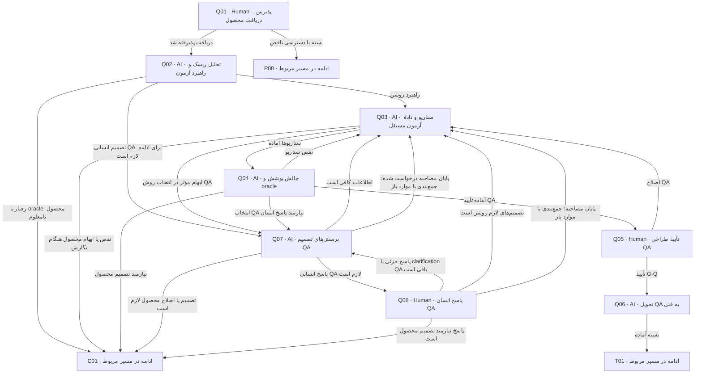

# طراحی QA پیش از طراحی فنی

دریافت محصول مصوب، گفت‌وگوی QA با AI، تهیه و review اسناد، تأیید انسانی و handover فنی؛ ابهام محصول با اصلاحیه برمی‌گردد.

> کارت‌ها از [graph.json](graph.json) تولید می‌شوند. توقف، انتظار و retry مشترک در [قرارداد node](00-node-contract.md) اعمال می‌شود.

## Q01 — پذیرش دریافت محصول

**مجری:** Human — QA owner

**ورودی:** handover محصول، G-P و manifest

**کار دقیق:** همان bytes و scope را باز کن؛ مسئولیت تحلیل QA را بپذیر. دریافت را با baseline ثبت کن؛ اگر فایل/تأیید غایب است دلیل بازگشت بده. پرونده باید قبلاً توسط کاربر از صف تیم انتخاب شده باشد؛ پیش از دریافت اعتبار نسخه‌ها را دوباره بررسی کن. اگر receipt معتبر همین نسخه از قبل ثبت شده، طبق checkpoint ادامه بده. پس از دریافت، حرکت را در tracking ثبت و وضعیت در حال کار و تیم مسئول را فقط در کارت board.json به‌روز کن.

**خروجی:** receipt محصول→QA

**شرط پایان:** دریافت نسخه معتبر و انتساب QA روشن است.

| نتیجه | node بعدی |
|---|---|
| دریافت پذیرفته شد | [Q02](03-qa.md#q02) |
| بسته یا دسترسی ناقص | [P08](02-product.md#p08) |

## Q02 — تحلیل ریسک و راهبرد آزمون

**مجری:** AI — QA analyst

**ورودی:** product baseline، UC/AC و محدودیت‌های محیط

**کار دقیق:** هر قاعده و transition را به کلاس‌های موفق، منفی، حد، نقش، تکرار، concurrency، uncertainty و recovery بررسی کن. risk و priority را از هم جدا کن. oracle نامعلوم gap محصول است؛ نیاز جدید نساز. طبق docs/11-documentation-cycle.md، پاسخ‌های قبلی و تصمیم‌های QA را بخوان؛ انتخاب حل‌نشدهٔ راهبرد، اولویت یا محیط را برای Q07 مشخص کن. اگر تصمیم مؤثر باز نیست، دلیل کفایت را در qa/interview.md ثبت و نگارش را ادامه بده.

**خروجی:** qa/plan.md و risk/applicability matrix؛ qa/interview.md با منابع و ابهام‌های مؤثر یا دلیل کفایت

**شرط پایان:** ریسک‌ها و ابهام‌ها به منبع و صاحب تصمیم متصل‌اند؛ انتظار محصول از انتخاب روش QA جداست.

| نتیجه | node بعدی |
|---|---|
| راهبرد روشن | [Q03](03-qa.md#q03) |
| رفتار یا oracle محصول نامعلوم | [C01](07-change-and-bug.md#c01) |
| تصمیم انسانی QA برای ادامه لازم است | [Q07](03-qa.md#q07) |

## Q03 — سناریو و دادهٔ آزمون مستقل

**مجری:** AI — QA analyst

**ورودی:** plan، محصول و پذیرش‌های مبنا

**کار دقیق:** برای هر سناریو Given/When/Then، precondition، actor، دادهٔ ساختگی، ترتیب/زمان/هم‌زمانی، نتیجه و عدم‌اثر ممنوع، observable evidence و cleanup بنویس. ACها را گسترش بده؛ به ساختار کدی که هنوز طراحی نشده وابسته نکن. handover همان مرحله را نیز پیش از review به‌صورت draft کامل بنویس تا همراه بقیه اسناد در manifest نامزد تأیید باشد. برای هر QA-ID، scope ماژولی، integration یا end-to-end و ماژول‌های محتمل را ثبت کن. سناریوی مشترک تک‌مرجع باشد؛ انتساب فنی دقیق در T05 تکمیل می‌شود. فقط فایل‌های QA نوشته شوند؛ نگاشت مشترک traceability توسط Coordinator از خروجی QA ثبت شود.

**خروجی:** qa/scenarios.md، coverage و traceability

**شرط پایان:** هر AC در scope پوشش دارد؛ expected result قابل سنجش و دارای source است.

| نتیجه | node بعدی |
|---|---|
| سناریوها آماده | [Q04](03-qa.md#q04) |
| ابهام مؤثر در انتخاب روش QA | [Q07](03-qa.md#q07) |
| نقص یا ابهام محصول هنگام نگارش | [C01](07-change-and-bug.md#c01) |

## Q04 — چالش پوشش و oracle

**مجری:** AI — QA reviewer مستقل یا reviewer انسانی

**ورودی:** plan/scenarios، قرارداد محصول و coverage

**کار دقیق:** یک بار از rule به scenario و یک بار از scenario به source بررسی کن. false positive، تست صرفاً happy-path، زمان/مرز نامعین و omitted failure را پیدا کن. performance/security claim بی‌معیار رد شود. تصمیم‌های qa/interview.md و پاسخ‌های جزئی را با اسناد تطبیق بده؛ مورد باز مؤثر مانع ارائه برای G-Q است. مصاحبهٔ همین نسخه نیز در manifest Q freeze شود.

**خروجی:** QA review، gap list و پوشش هر risk؛ manifest immutable Q candidate شامل handover پس از رفع یافته‌ها

**شرط پایان:** هیچ oracle ساختگی، AC بی‌پوشش یا critical risk بی‌تصمیم نمانده.

| نتیجه | node بعدی |
|---|---|
| نقص سناریو | [Q03](03-qa.md#q03) |
| نیازمند تصمیم محصول | [C01](07-change-and-bug.md#c01) |
| آماده تأیید QA | [Q05](03-qa.md#q05) |
| انتخاب QA نیازمند پاسخ انسان | [Q07](03-qa.md#q07) |

## Q05 — تأیید طراحی QA

**مجری:** Human — QA owner

**ورودی:** نسخه سناریو و coverage، review و manifest Q candidate

**کار دقیق:** scope، اولویت، oracle، environment نیازمند تهیه و شرط entry/exit execution را تصویب کن. حالت همه تست‌ها not-run است؛ پذیرش برنامه، pass آزمون نیست. پاسخ‌های مصاحبه، رأی این gate نیستند؛ رأی صریح روی manifest نامزد لازم است.

**خروجی:** G-Q approval با baseline محصول مرتبط

**شرط پایان:** QA owner کیفیت برنامه را پذیرفته و blocker oracle باقی نیست.

| نتیجه | node بعدی |
|---|---|
| تأیید G-Q | [Q06](03-qa.md#q06) |
| اصلاح QA | [Q03](03-qa.md#q03) |

## Q06 — تحویل QA به فنی

**مجری:** AI — Coordinator

**ورودی:** G-P و G-Q معتبر، plan/scenarios

**کار دقیق:** بستهٔ QA منجمد و مصوب را کنترل کن؛ read order، بحرانی‌ها، نیاز fixture/clock/fault injection و نتایج ممنوع را در handover موجود تطبیق بده. از فنی testability و mapping بخواه، نه تغییر oracle. handover و manifest باید همان bytes ارائه‌شده پیش از approval باشند؛ در این node محتوای بسته تغییر نمی‌کند و فقط دسترسی/receipt/journal آماده می‌شود. هر اصلاح محتوا به review و approval نسخه تازه برمی‌گردد. پس از کنترل آمادگی، tracking و برد را به صف آمادهٔ فنی به‌روز کن؛ nextNode=T01 است. تا انتخاب/دریافت واقعی تیم بعد منتظر بمان؛ انتقال کارت دریافت انسانی نیست.

**خروجی:** رکورد تحویل با ارجاع qa/handover.md و baseline Q ثابت با parent P؛ receipt فنی pending

**شرط پایان:** نسخه‌های محصول و QA منطبق و دریافت فنی pending است.

| نتیجه | node بعدی |
|---|---|
| بسته آماده | [T01](04-technical.md#t01) |

## Q07 — پرسش‌های تصمیم QA

**مجری:** AI — QA interviewer

**ورودی:** محصول مصوب، تحلیل/پیش‌نویس QA و qa/interview.md

**کار دقیق:** طبق docs/11-documentation-cycle.md، حداکثر پنج سؤال مؤثر دربارهٔ انتخاب‌های QA با گزینه‌های واقعی، پیشنهاد و دلیل ارائه کن. پاسخ‌های قبلی را تکرار نکن؛ پاسخ جزئی فقط موارد باز همان batch را نگه می‌دارد. سؤال دربارهٔ رفتار یا oracle محصول به C01 برود. انتظار پاسخ و resumeNode=Q08 توسط Coordinator در journal ثبت شود.

**خروجی:** qa/interview.md با متن سؤال‌ها، پیشنهاد AI و وضعیت هر سؤال

**شرط پایان:** سؤال قابل پاسخ و صاحب تصمیم معلوم است، یا دلیل کفایت/پایان ثبت شده.

| نتیجه | node بعدی |
|---|---|
| پاسخ انسانی QA لازم است | [Q08](03-qa.md#q08) |
| اطلاعات کافی است | [Q03](03-qa.md#q03) |
| پایان مصاحبه درخواست شده؛ جمع‌بندی با موارد باز | [Q03](03-qa.md#q03) |
| تصمیم یا اصلاح محصول لازم است | [C01](07-change-and-bug.md#c01) |

## Q08 — پاسخ انسان QA

**مجری:** Human — QA owner یا صاحب تصمیم منصوب در QA

**ورودی:** سؤال‌های باز Q07 و همان baseline محصول

**کار دقیق:** پاسخ واقعی با مرجع پیام را ثبت کن؛ QA فقط دربارهٔ روش و محدودهٔ مجاز QA تصمیم می‌گیرد. AI ثبت‌کننده در qa/interview.md است و پیشنهاد خودش را پاسخ انسان نمی‌کند. پاسخ جزئی batch را باز می‌گذارد. درخواست انتظار یا scope تازهٔ محصول با اصلاحیه به C01 برود. پایان مصاحبه به معنی تأیید بسته نیست.

**خروجی:** پاسخ‌ها و تصمیم‌های QA با مرجع، موارد باز و اثر بر plan/scenario

**شرط پایان:** پاسخ واقعی یا درخواست پایان ثبت شده؛ سکوت پاسخ نیست.

| نتیجه | node بعدی |
|---|---|
| پاسخ جزئی یا clarification QA باقی است | [Q07](03-qa.md#q07) |
| تصمیم‌های لازم روشن است | [Q03](03-qa.md#q03) |
| پایان مصاحبه؛ جمع‌بندی با موارد باز | [Q03](03-qa.md#q03) |
| پاسخ نیازمند تصمیم محصول است | [C01](07-change-and-bug.md#c01) |
