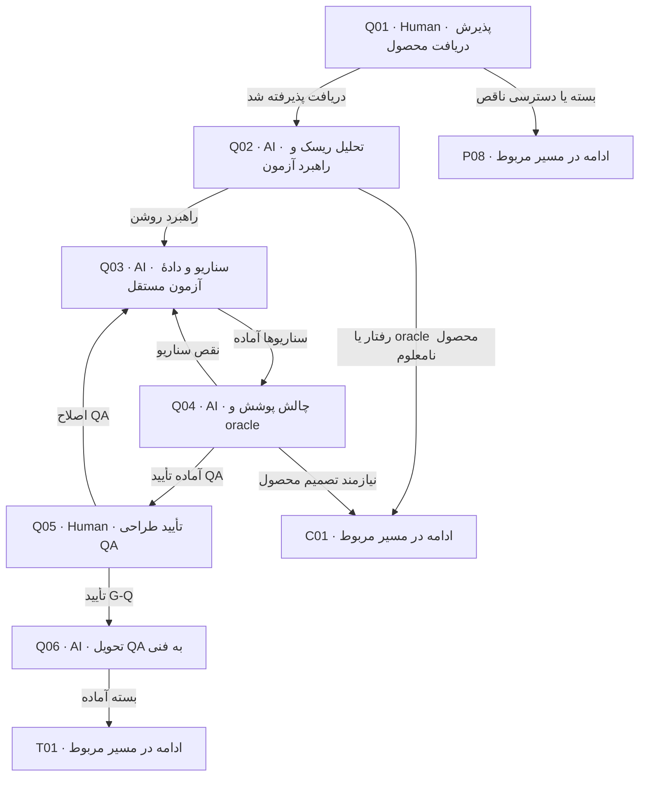

# طراحی QA پیش از طراحی فنی

QA سناریو، oracle و ریسک را از محصول استخراج می‌کند. در این مرحله آزمون اجرایی تولید یا pass گزارش نمی‌شود؛ جزئیات ابزار در فنی تعیین خواهد شد.

> کارت‌ها از [graph.json](graph.json) تولید می‌شوند. توقف، انتظار و retry مشترک در [قرارداد node](00-node-contract.md) اعمال می‌شود.

## Q01 — پذیرش دریافت محصول

**مجری:** Human — QA owner

**ورودی:** handover محصول، G-P و manifest

**کار دقیق:** همان bytes و scope را باز کن؛ مسئولیت تحلیل QA را بپذیر. دریافت را با baseline ثبت کن؛ اگر فایل/تأیید غایب است دلیل بازگشت بده. پرونده باید قبلاً توسط کاربر از صف تیم انتخاب شده باشد؛ پیش از دریافت اعتبار نسخه‌ها را دوباره بررسی کن. اگر receipt معتبر همین نسخه از قبل ثبت شده، طبق checkpoint ادامه بده. پس از دریافت، حرکت را در tracking ثبت و وضعیت در حال کار و تیم مسئول را فقط در کارت board.json به‌روز کن.

**خروجی:** receipt محصول→QA

**شرط پایان:** دریافت نسخه معتبر و انتساب QA روشن است.

| نتیجه | node بعدی |
|---|---|
| دریافت پذیرفته شد | [Q02](03-qa.md#q02) |
| بسته یا دسترسی ناقص | [P08](02-product.md#p08) |

## Q02 — تحلیل ریسک و راهبرد آزمون

**مجری:** AI — QA analyst

**ورودی:** product baseline، UC/AC و محدودیت‌های محیط

**کار دقیق:** هر قاعده و transition را به کلاس‌های موفق، منفی، حد، نقش، تکرار، concurrency، uncertainty و recovery بررسی کن. risk و priority را از هم جدا کن. oracle نامعلوم gap محصول است؛ نیاز جدید نساز.

**خروجی:** qa/plan.md و risk/applicability matrix

**شرط پایان:** ریسک‌های واقعی و N/A مستدل؛ test type و oracle owner تعیین شده‌اند.

| نتیجه | node بعدی |
|---|---|
| راهبرد روشن | [Q03](03-qa.md#q03) |
| رفتار یا oracle محصول نامعلوم | [C01](07-change-and-bug.md#c01) |

## Q03 — سناریو و دادهٔ آزمون مستقل

**مجری:** AI — QA analyst

**ورودی:** plan، محصول و پذیرش‌های مبنا

**کار دقیق:** برای هر سناریو Given/When/Then، precondition، actor، دادهٔ ساختگی، ترتیب/زمان/هم‌زمانی، نتیجه و عدم‌اثر ممنوع، observable evidence و cleanup بنویس. ACها را گسترش بده؛ به ساختار کدی که هنوز طراحی نشده وابسته نکن. handover همان مرحله را نیز پیش از review به‌صورت draft کامل بنویس تا همراه بقیه اسناد در manifest نامزد تأیید باشد. برای هر QA-ID، scope ماژولی، integration یا end-to-end و ماژول‌های محتمل را ثبت کن. سناریوی مشترک تک‌مرجع باشد؛ انتساب فنی دقیق در T05 تکمیل می‌شود. فقط فایل‌های QA نوشته شوند؛ نگاشت مشترک traceability توسط Coordinator از خروجی QA ثبت شود.

**خروجی:** qa/scenarios.md، coverage و traceability

**شرط پایان:** هر AC در scope پوشش دارد؛ expected result قابل سنجش و دارای source است.

| نتیجه | node بعدی |
|---|---|
| سناریوها آماده | [Q04](03-qa.md#q04) |

## Q04 — چالش پوشش و oracle

**مجری:** AI — QA reviewer مستقل یا reviewer انسانی

**ورودی:** plan/scenarios، قرارداد محصول و coverage

**کار دقیق:** یک بار از rule به scenario و یک بار از scenario به source بررسی کن. false positive، تست صرفاً happy-path، زمان/مرز نامعین و omitted failure را پیدا کن. performance/security claim بی‌معیار رد شود.

**خروجی:** QA review، gap list و پوشش هر risk؛ manifest immutable Q candidate شامل handover پس از رفع یافته‌ها

**شرط پایان:** هیچ oracle ساختگی، AC بی‌پوشش یا critical risk بی‌تصمیم نمانده.

| نتیجه | node بعدی |
|---|---|
| نقص سناریو | [Q03](03-qa.md#q03) |
| نیازمند تصمیم محصول | [C01](07-change-and-bug.md#c01) |
| آماده تأیید QA | [Q05](03-qa.md#q05) |

## Q05 — تأیید طراحی QA

**مجری:** Human — QA owner

**ورودی:** نسخه سناریو و coverage، review و manifest Q candidate

**کار دقیق:** scope، اولویت، oracle، environment نیازمند تهیه و شرط entry/exit execution را تصویب کن. حالت همه تست‌ها not-run است؛ پذیرش برنامه، pass آزمون نیست.

**خروجی:** G-Q approval با baseline محصول مرتبط

**شرط پایان:** QA owner کیفیت برنامه را پذیرفته و blocker oracle باقی نیست.

| نتیجه | node بعدی |
|---|---|
| تأیید G-Q | [Q06](03-qa.md#q06) |
| اصلاح QA | [Q03](03-qa.md#q03) |

## Q06 — تحویل QA به فنی

**مجری:** AI — Coordinator

**ورودی:** G-P و G-Q معتبر، plan/scenarios

**کار دقیق:** بستهٔ QA را freeze؛ read order، بحرانی‌ها، نیاز fixture/clock/fault injection و نتایج ممنوع را در handover بنویس. از فنی testability و mapping بخواه، نه تغییر oracle. handover و manifest باید همان bytes ارائه‌شده پیش از approval باشند؛ در این node محتوای بسته تغییر نمی‌کند و فقط دسترسی/receipt/journal آماده می‌شود. هر اصلاح محتوا به review و approval نسخه تازه برمی‌گردد. پس از کنترل آمادگی، tracking و برد را به صف آمادهٔ فنی به‌روز کن؛ nextNode=T01 است. تا انتخاب/دریافت واقعی تیم بعد منتظر بمان؛ انتقال کارت دریافت انسانی نیست.

**خروجی:** qa/handover.md و baseline Q با parent P سناریوهای ماژولی و سرتاسری با QA-ID یکتا و targetهای محتمل.

**شرط پایان:** نسخه‌های محصول و QA منطبق و دریافت فنی pending است.

| نتیجه | node بعدی |
|---|---|
| بسته آماده | [T01](04-technical.md#t01) |
