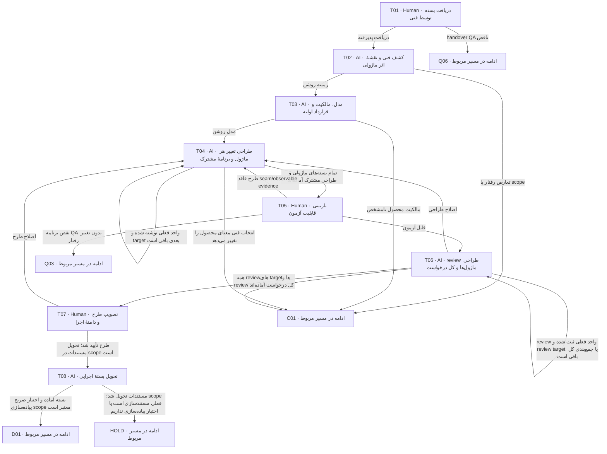

# طراحی فنی مطابق Backend

فنی طراحی قابل پیاده‌سازی و قابل آزمون می‌سازد. رفتار محصول و oracle QA ورودی ثابت‌اند؛ feasibility یا تغییر observable به owner درست برمی‌گردد.

> کارت‌ها از [graph.json](graph.json) تولید می‌شوند. توقف، انتظار و retry مشترک در [قرارداد node](00-node-contract.md) اعمال می‌شود.

## T01 — دریافت بسته توسط فنی

**مجری:** Human — Tech lead

**ورودی:** product/QA handover و approvalهای معتبر یا baseline ارجاع‌شده technical-only

**کار دقیق:** نسخه‌ها، scope، ownerهای متأثر و مسئول طراحی را تأیید دریافت کن. برای کار فنی صرف، evidence عدم تغییر رفتار و baseline QA را بررسی کن. پرونده باید قبلاً توسط کاربر از صف تیم انتخاب شده باشد؛ پیش از دریافت اعتبار نسخه‌ها را دوباره بررسی کن. اگر receipt معتبر همین نسخه از قبل ثبت شده، طبق checkpoint ادامه بده. پس از دریافت، حرکت را در tracking ثبت و وضعیت در حال کار و تیم مسئول را فقط در کارت board.json به‌روز کن.

**خروجی:** receipt QA→Tech و مسئول طراحی

**شرط پایان:** دسترسی و مسئولیت پذیرفته و دو baseline معتبرند.

| نتیجه | node بعدی |
|---|---|
| دریافت پذیرفته | [T02](04-technical.md#t02) |
| handover QA ناقص | [Q06](03-qa.md#q06) |

## T02 — کشف فنی و نقشهٔ اثر ماژولی

**مجری:** AI — Technical designer

**ورودی:** P/Q baseline، Backend AGENTS/handbook/authority و source revision

**کار دقیق:** doctor و explain مسیرهای هدف را بخوان/اجرا و workflow اصلی Backend را انتخاب کن. owner/host/POM/policy/config/tests را trace کن. implemented/optional/reference/unavailable را تفکیک؛ platform gap را task لازم بدان. topology جدید را از انسان فنی بگیر، نه از probe. technical/impact-map.md را با IMPACT-ID برای همه ownerهای متأثر بساز: direct، dependent، compatibility-only، شاهد اثر، نیاز به کد و مسئول فنی. source/caller/consumer/config را برای اثر غیرمستقیم بررسی کن. host/platform را component target جدا و موارد unaffected را با دلیل ثبت کن. checkout هدف ورودی معرفی‌شدهٔ همان پرونده است؛ هیچ مسیر نصب همسایه فرض نشود. قرارداد داخلی docs/05-backend-binding.md و قالب‌های فنی همین مخزن راهنمای طراحی‌اند؛ انطباق با کد واقعی فقط از checkout فعلی سنجیده شود.

**خروجی:** technical/index، discovery، capability/gap و rule binding impact-map، index بستهٔ هر ماژول و فهرست EDGE-ID وابستگی‌ها.

**شرط پایان:** مسیرهای واقعی و baseline معماری ثبت شده؛ drift به requirement تبدیل نشده. هیچ ماژول یا component مشمول بدون نوع اثر و owner پاسخ‌گو نمانده؛ unknown به‌جای unaffected ثبت نمی‌شود.

| نتیجه | node بعدی |
|---|---|
| زمینه روشن | [T03](04-technical.md#t03) |
| تعارض رفتار یا scope | [C01](07-change-and-bug.md#c01) |

## T03 — مدل، مالکیت و قرارداد اولیه

**مجری:** AI — Technical designer

**ورودی:** discovery، vocabulary، product rules و QA risks

**کار دقیق:** module/context map، aggregate/invariant یا read-store، public/private boundary و سه graph را طراحی کن. مدل مفهومی محصول را مستقیماً جدول/aggregate نکن. input/output/error و trust boundary پیش از کد مشخص شوند. ساختار technical/modules/<slug>/ را برای ماژول‌های impact-map مشخص و cross-module-flows.md را برای جریان و قراردادهای مشترک تهیه کن. هر owner مدل canonical خودش را دارد؛ delta درخواست در change-spec ثبت می‌شود.

**خروجی:** module/context/domain candidate و فهرست TECH operationها

**شرط پایان:** مالک هر invariant/commit/داده روشن و boundary بی‌دلیل مشترک نشده.

| نتیجه | node بعدی |
|---|---|
| مدل روشن | [T04](04-technical.md#t04) |
| مالکیت محصول نامشخص | [C01](07-change-and-bug.md#c01) |

## T04 — طراحی تغییر هر ماژول و برنامهٔ مشترک

**مجری:** AI — Technical designer

**ورودی:** مدل، QA scenarios، Backend rules و applicability

**کار دقیق:** برای هر operation DTO presence/null/bounds، execute/context، auth، sequence و failure، Work/receipt/audit/Outbox، unknown/reconcile بنویس. data/migration، communication/provider، recording، host/role/config/observability را فقط در صورت نیاز تکمیل کن. نام فایل/port/test و plan slice را تعیین کن. انتخاب‌های نیازمند اختیار انسانی را برای T07 آماده کن. handover همان مرحله را نیز پیش از review به‌صورت draft کامل بنویس تا همراه بقیه اسناد در manifest نامزد تأیید باشد. برای هر target یک workUnit با change-spec و test-mapping بساز. طراحی تفصیلی به اسناد canonical Backend ارجاع نسخه‌دار دارد. target بدون تغییر کد بستهٔ تحلیل سازگاری و task تست می‌گیرد. implementation-plan کل در technical/، ترتیب dependency و مشخصات taskهای آینده با مسئول و مسیر مقصد را تعیین می‌کند؛ ایجاد فایل task در development/ با تیم توسعه در D01 است. آخرین واحد، طراحی integration و handover کل را جمع‌بندی می‌کند.

**خروجی:** اسناد technical canonical و implementation/test mapping plan technical/modules/<slug>/change-spec.md و test-mapping.md برای همه ماژول‌ها؛ بستهٔ components در صورت اثر host/platform.

**شرط پایان:** هر QA scenario مسیر اثبات دارد؛ component غایب، پنهان یا stub-success فرض نشده.

| نتیجه | node بعدی |
|---|---|
| تمام بسته‌های ماژولی و طراحی مشترک آماده‌اند | [T05](04-technical.md#t05) |
| انتخاب فنی معنای محصول را تغییر می‌دهد | [C01](07-change-and-bug.md#c01) |
| واحد فعلی نوشته شده و target بعدی باقی است | [T04](04-technical.md#t04) |

## T05 — بازبینی قابلیت آزمون

**مجری:** Human — QA owner با تحلیل QA agent

**ورودی:** طرح فنی و mapping QA→suite→fixture/evidence

**کار دقیق:** بررسی کن clock، fault، concurrency و oracle قابل مشاهده‌اند؛ unit fake را با durability واقعی اشتباه نکن. افزودن scenario فنی با source backend-rule مجاز است؛ انتظار محصول عوض نشود. همه test-mappingهای ماژولی و targetهای compatibility-only را با impact-map تطبیق بده؛ integration/end-to-end هر EDGE/FLOW باید oracle، مسئول execution و candidate مشترک داشته باشد. انتساب فنی QA-IDهای مشترک را بدون کپی oracle نهایی کن. تیم QA فقط تحلیل و یافتهٔ خودش را ارائه می‌دهد؛ Coordinator رکورد review را ثبت می‌کند و هر اصلاح فایل technical/test-mapping با تیم فنی در T04 است. ثبت نتیجهٔ QA، مجوز ویرایش سند فنی یا تغییر خودکار تیم agent نیست.

**خروجی:** testability review و تأیید mapping یا gap مشخص

**شرط پایان:** همه سناریوهای لازم محل اجرا، fixture، owner و خروجی سنجش دارند.

| نتیجه | node بعدی |
|---|---|
| قابل آزمون | [T06](04-technical.md#t06) |
| طرح فاقد seam/observable evidence | [T04](04-technical.md#t04) |
| نقص برنامه QA بدون تغییر رفتار | [Q03](03-qa.md#q03) |

## T06 — review طراحی ماژول‌ها و کل درخواست

**مجری:** AI — Technical reviewer مستقل یا reviewer انسانی

**ورودی:** تمام technical docs، Backend rules، P/Q baseline و testability

**کار دقیق:** POM/import/SQL و call/event/recovery graph را بررسی کن. owner-local transaction، replay auth، privacy، migration، failure و capability gaps را بسنج. canonical location و عدم وجود دو نسخه مرجع editable را کنترل کن. ابتدا هر target را در workUnit مستقل review کن، سپس قراردادهای مشترک و consistency کل درخواست را بسنج. یافتهٔ edge به producer و consumer و QA مشترک متصل شود؛ manifest T شامل تمام بسته‌های ماژولی و طرح مشترک است.

**خروجی:** review فنی، ADRهای لازم و manifest immutable T candidate شامل handover توسعه

**شرط پایان:** تمام blocking findingها بسته و انحراف بی‌ADR/اختیار باقی نیست.

| نتیجه | node بعدی |
|---|---|
| اصلاح طراحی | [T04](04-technical.md#t04) |
| تعارض نیاز | [C01](07-change-and-bug.md#c01) |
| همه reviewهای targetها و review کل درخواست آماده‌اند | [T07](04-technical.md#t07) |
| review واحد فعلی ثبت شده و review target یا جمع‌بندی کل باقی است | [T06](04-technical.md#t06) |

## T07 — تصویب طرح و دامنهٔ اجرا

**مجری:** Human — Tech lead و مسئولان فنی ماژول‌های متأثر؛ owner زیرساخت برای انتخاب عملیاتی

**ورودی:** طرح کامل، review، testability، gap، هزینه/ریسک و T manifest

**کار دقیق:** طراحی و ترتیب sliceها را approve کن؛ انتخاب topology/profile و prerequisiteهای واقعی را مشخص کن. تأیید طراحی را از اختیار پیاده‌سازی جدا ثبت کن. برای درخواست مستندات، نبود اختیار پیاده‌سازی مانع تصویب طرح نیست؛ اجرای کد فقط با دستور صریح scope در request یا تصمیم جدا مجاز است. تأیید سند به‌تنهایی مجوز اجرا یا deploy نیست. رأی مسئول فنی هر target و رأی نهایی Tech lead برای کل درخواست روی همان manifest ثبت شوند؛ یک انسان منصوب می‌تواند چند نقش را پوشش دهد. G-T با local-ready چند ماژول و dependency باز عبور نمی‌کند.

**خروجی:** G-T approval و وضعیت مستقل اختیار پیاده‌سازی؛ reference دستور فقط در صورت وجود

**شرط پایان:** G-P/G-Q معتبر، QA testability پذیرفته و تصمیم اجرایی لازم روشن است.

| نتیجه | node بعدی |
|---|---|
| طرح تأیید شد؛ تحویل مستندات در scope است | [T08](04-technical.md#t08) |
| اصلاح طرح | [T04](04-technical.md#t04) |

## T08 — تحویل بستهٔ اجرایی

**مجری:** AI — Coordinator

**ورودی:** G-T، technical canonical docs، P/Q و plan

**کار دقیق:** manifest T و handover توسعه را بساز؛ read order، مسیر فایل‌ها، task dependency، دستورهای verification، خطرهای migration و خروجی review را مشخص کن. هیچ unresolved blocker به developer واگذار نشود. handover و manifest باید همان bytes ارائه‌شده پیش از approval باشند؛ در این node محتوای بسته تغییر نمی‌کند و فقط دسترسی/receipt/journal آماده می‌شود. هر اصلاح محتوا به review و approval نسخه تازه برمی‌گردد. handover واحد، فهرست بسته‌های ماژولی، ترتیب taskهای وابسته، reviewer/مسئول هر target و مسئول integration را نشان می‌دهد؛ تحویل اداری جداگانه برای تک‌تک ماژول‌ها اجباری نیست. tracking و برد را به «مستندات فنی آماده» به‌روز کن. برای scope مستندسازی، پایان همین تحویل را ثبت و ادامهٔ توسعه را HOLD با resumeNode=D01 و شرط دستور صریح پیاده‌سازی نگه دار؛ G-T به‌تنهایی آن دستور نیست.

**خروجی:** technical/handover، task packet و baseline T با parent P/Q

**شرط پایان:** بسته برای agent بعدی بدون تکیه بر حافظهٔ گفت‌وگو کافی است.

| نتیجه | node بعدی |
|---|---|
| بسته آماده و اختیار صریح پیاده‌سازی scope معتبر است | [D01](05-implementation.md#d01) |
| مستندات تحویل شد؛ scope فعلی مستندسازی است یا اختیار پیاده‌سازی نداریم | HOLD |
