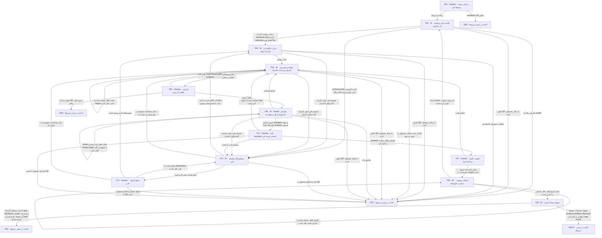

# طراحی فنی مطابق Backend

محصول/QA مصوب + اتصال فقط خواندنی ../BackendName → طراحی فنی و snapshotهای مصوب داخل product-workflow → تحویل مستندات و HOLD برای گیرندهٔ مستقل Backend.

> کارت‌ها از [graph.json](graph.json) تولید می‌شوند. توقف، انتظار و retry مشترک در [قرارداد node](00-node-contract.md) اعمال می‌شود.

## T01 — دریافت بسته توسط فنی

**مجری:** Human — Tech lead

**ورودی:** product/QA handover و approvalهای معتبر یا baseline ارجاع‌شده technical-only

**کار دقیق:** طبق docs/12-request-onboarding.md پیش از این node، پس از انتخاب صریح پرونده، AI باید کل مستندات موجود و مراجع لازم را بخواند و درخواست را با جزئیات برای کاربر توضیح دهد؛ این گزارش receipt یا approval نیست. نسخه‌ها، scope، ownerهای متأثر و مسئول طراحی را تأیید دریافت کن. برای کار فنی صرف، evidence عدم تغییر رفتار و baseline QA را بررسی کن. پرونده باید قبلاً توسط کاربر از صف تیم انتخاب شده باشد؛ پیش از دریافت اعتبار نسخه‌ها را دوباره بررسی کن. اگر receipt معتبر همین نسخه از قبل ثبت شده، طبق checkpoint ادامه بده. پس از دریافت، حرکت را در tracking ثبت و وضعیت در حال کار و تیم مسئول را فقط در کارت board.json به‌روز کن. اتصال project/backend.json را بخوان؛ اگر ثبت نشده از skill setup فقط نام دایرکتوری بگیر. Backend همیشه ../BackendName است و هیچ فایل/ابزار آن تغییر/اجرا نمی‌شود. گزارش setup اتصال، receipt درخواست یا approval نیست.

**خروجی:** receipt QA→Tech و مسئول طراحی

**شرط پایان:** دسترسی و مسئولیت پذیرفته و دو baseline معتبرند.

| نتیجه | node بعدی |
|---|---|
| دریافت پذیرفته | [T02](04-technical.md#t02) |
| handover QA ناقص | [Q06](03-qa.md#q06) |

## T02 — کشف فنی و نقشهٔ اثر ماژولی

**مجری:** AI — Technical designer

**ورودی:** P/Q baseline، Backend AGENTS/handbook/authority و source revision؛ منابع setup و baseline معماری هدف طبق docs/15-setup-bound-architecture.md

**کار دقیق:** AGENTS، docs معماری/authority، record/plan setup و شواهد موجود مسیرهای هدف را فقط بخوان؛ doctor/explain یا هیچ ابزار Backend را اجرا نکن. workflow اصلی گیرندهٔ مستقل Backend را برای handover مشخص کن. owner/host/POM/policy/config/tests را trace کن. implemented/optional/reference/unavailable را تفکیک؛ platform gap را task لازم بدان. topology جدید را از انسان فنی بگیر، نه از probe. technical/impact-map.md را با IMPACT-ID برای همه ownerهای متأثر بساز: direct، dependent، compatibility-only، شاهد اثر، نیاز به کد و مسئول فنی. source/caller/consumer/config را برای اثر غیرمستقیم بررسی کن. host/platform را component target جدا و موارد unaffected را با دلیل ثبت کن. checkout هدف از project/backend.json با قاعدهٔ ../BackendName خوانده می‌شود؛ نام ثبت‌شده تکرار و Backend دیگری جایگزین نشود. قرارداد داخلی docs/05-backend-binding.md و قالب‌های فنی همین مخزن راهنمای طراحی‌اند؛ انطباق با کد واقعی فقط از checkout فعلی سنجیده شود. مشخصات repository، مسیر checkout، revision و مسیر AGENTS/قواعد هدف را فقط در technical/index.md همین پرونده ثبت کن؛ request.md محصول فقط خواندنی است. نسخهٔ جاری و digest ماژول از modules/<slug>/current.json و تفاوت طرح مصوب با کد همان revision را ثبت کن؛ ماژول تازه baseRevision=null دارد. طبق docs/11-documentation-cycle.md، ابهام‌های مؤثر معماری/محیط و پاسخ‌های قبلی را در technical/interview.md ثبت کن؛ اگر پاسخ تازه لازم نیست دلیل کفایت را ثبت کن. برای technical-only تازه پس از کشف، به interview فنی T10/T11 برو؛ پرسش‌نامهٔ اولیهٔ محصول ندارد. پاسخ/اطلاعات روشن قبلی تکرار و سؤال مصنوعی ساخته نشود؛ کفایت اطلاعات در T10 ثبت می‌شود. طبق docs/15-setup-bound-architecture.md، پیش از طراحی وابسته به Backend وضعیت setup و منابع قواعد را بخوان؛ در index مسیر/digest record و plan منتخب setup، source revision و dirty/diff و قواعد/edition/profile/تصمیم‌های محلی را ثبت کن. inspection فایل‌های غیرحساس setup مجاز است؛ command/code Backend اجرا نمی‌شود. preflight و planning/Spec/Plan/Task داخل Backend به گیرندهٔ مستقل تحویل می‌شوند. setup ناقص به setup/recovery با owner برمی‌گردد؛ پیش‌نویس بیرونی منطبق یا آماده اجرا معرفی نمی‌شود. مقادیر secret و environment به پرونده کپی نشوند. قابلیت موجود در source، selected در setup، configured با override معلوم و verified-runtime را جدا با source/hash و محدودیت ثبت کن؛ recorded-completed یا وجود کد معادل فعال/verified نیست.

**خروجی:** technical/index، discovery، capability/gap و rule binding impact-map، index بستهٔ هر ماژول و فهرست EDGE-ID وابستگی‌ها. technical/interview.md با ابهام‌ها و منابع یا دلیل کفایت.

**شرط پایان:** مسیرهای واقعی و baseline معماری ثبت شده؛ drift به requirement تبدیل نشده. هیچ ماژول یا component مشمول بدون نوع اثر و owner پاسخ‌گو نمانده؛ unknown به‌جای unaffected ثبت نمی‌شود. ابهام تصمیم فنی می‌تواند به T10 برود؛ نبود شاهد فنی همچنان blocked است. baseline معتبر setup و قواعد معماری یا وضعیت blocked/draft با owner و prerequisite مشخص.

| نتیجه | node بعدی |
|---|---|
| زمینه روشن؛ غیر از technical-only تازه یا interview قبلاً انجام شده | [T03](04-technical.md#t03) |
| تعارض رفتار یا scope | [C01](07-change-and-bug.md#c01) |
| technical-only تازه یا تصمیم فنی مؤثر نیازمند گفت‌وگو | [T10](04-technical.md#t10) |
| نقص QA با رفتار محصول ثابت | [C01](07-change-and-bug.md#c01) |

## T03 — مدل، مالکیت و قرارداد اولیه

**مجری:** AI — Technical designer

**ورودی:** discovery، vocabulary، product rules و QA risks؛ تصمیم‌های technical/interview.md؛ منابع setup و baseline معماری هدف طبق docs/15-setup-bound-architecture.md

**کار دقیق:** module/context map، aggregate/invariant یا read-store، public/private boundary و سه graph را طراحی کن. مدل مفهومی محصول را مستقیماً جدول/aggregate نکن. input/output/error و trust boundary پیش از کد مشخص شوند. ساختار technical/modules/<slug>/ را برای ماژول‌های impact-map مشخص و cross-module-flows.md را برای جریان و قراردادهای مشترک تهیه کن. هر owner مدل canonical خودش را دارد؛ delta درخواست در change-spec ثبت می‌شود. تصمیم‌های موجود setup و قواعد Backend محدودیت مدل و مالکیت‌اند؛ تغییر stack/profile، مرز owner یا transaction ناسازگار، انتخاب آزاد طراحی نیست و به تصمیم صریح صاحب معماری با تحلیل اثر برمی‌گردد.

**خروجی:** module/context/domain candidate و فهرست TECH operationها

**شرط پایان:** مالک هر invariant/commit/داده روشن و boundary بی‌دلیل مشترک نشده. انطباق مدل با baseline setup و قواعد هدف ثبت شده است.

| نتیجه | node بعدی |
|---|---|
| مدل روشن | [T04](04-technical.md#t04) |
| مالکیت محصول نامشخص | [C01](07-change-and-bug.md#c01) |
| تصمیم فنی مؤثر نیازمند گفت‌وگو با انسان | [T10](04-technical.md#t10) |
| نقص QA با رفتار محصول ثابت | [C01](07-change-and-bug.md#c01) |

## T04 — طراحی تغییر هر ماژول و برنامهٔ مشترک

**مجری:** AI — Technical designer

**ورودی:** مدل، QA scenarios، Backend rules و applicability؛ منابع setup و baseline معماری هدف طبق docs/15-setup-bound-architecture.md

**کار دقیق:** برای هر operation DTO presence/null/bounds، execute/context، auth، sequence و failure، Work/receipt/audit/Outbox، unknown/reconcile بنویس. data/migration، communication/provider، recording، host/role/config/observability را فقط در صورت نیاز تکمیل کن. نام فایل/port/test و plan slice را تعیین کن. انتخاب‌های نیازمند اختیار انسانی را برای T07 آماده کن. handover همان مرحله را نیز پیش از review به‌صورت draft کامل بنویس تا همراه بقیه اسناد در manifest نامزد تأیید باشد. برای هر target یک workUnit با change-spec و test-mapping بساز. برای هر ماژول در snapshot/ همان بسته، وضعیت کامل تجمعی پس از delta و snapshot-plan با baseRevision، observedImplementation و hash فایل‌ها تهیه کن؛ templates/modules و docs/10-module-library.md مبنا هستند. تمام RULE/AC/QAهای مصوب و قسمت‌های بدون تغییر توضیح داده شوند؛ modules/ جاری تا G-T فقط خواندنی است. قواعد و revision اسناد Backend حفظ شوند. target بدون تغییر کد بستهٔ تحلیل سازگاری و task تست می‌گیرد. implementation-plan کل در technical/، ترتیب dependency و مشخصات taskهای آینده با مسئول و مسیر مقصد را تعیین می‌کند؛ ایجاد فایل task در development/ با تیم توسعه در D01 است. آخرین واحد، طراحی integration و handover کل را جمع‌بندی می‌کند. پاسخ‌های معتبر مصاحبه را در طراحی اعمال کن؛ پایان مصاحبه با سؤال باز فقط پیش‌نویس و owner/شرط ادامه می‌سازد و G-T را آماده نمی‌کند. در handover پیش از G-T فقط revisionId، مسیر مقصد و hash plan/فایل‌های snapshot را ثبت کن؛ digest wrapper انتشار و نتیجه T09 بعد از G-T در journal تحویل قرار می‌گیرند. طراحی فقط در چارچوب baseline setup و قواعد ثبت‌شده انجام شود؛ delta و تصمیم‌های باز مجاز از اصول موجود جدا باشند. طبق docs/15-setup-bound-architecture.md، طرح مصوب با Spec ready/change active SDD متفاوت است: Spec ready آزمون پذیرش با فایل/method واقعی لازم دارد و آماده‌سازی آن به گیرندهٔ مستقل Backend تحویل می‌شود. محل canonical طرح technical/ و snapshotهای modules/ داخل همین workflow است؛ تمام Backend فقط خواندنی می‌ماند.

**خروجی:** اسناد technical canonical و implementation/test mapping plan technical/modules/<slug>/change-spec.md و test-mapping.md برای همه ماژول‌ها؛ بستهٔ components در صورت اثر host/platform.؛ snapshot کامل و snapshot-plan هر ماژول در بستهٔ درخواست، بدون تغییر وضعیت جاری modules/

**شرط پایان:** هر QA scenario مسیر اثبات دارد؛ component غایب، پنهان یا stub-success فرض نشده. وضعیت طراحی، آزمون پذیرش موجود و آمادگی activation SDD جدا و واقعی ثبت شده‌اند.

| نتیجه | node بعدی |
|---|---|
| تمام بسته‌های ماژولی و طراحی مشترک آماده‌اند | [T05](04-technical.md#t05) |
| انتخاب فنی معنای محصول را تغییر می‌دهد | [C01](07-change-and-bug.md#c01) |
| واحد فعلی نوشته شده و target بعدی باقی است | [T04](04-technical.md#t04) |
| تصمیم فنی مؤثر نیازمند گفت‌وگو با انسان | [T10](04-technical.md#t10) |
| نقص QA با رفتار محصول ثابت | [C01](07-change-and-bug.md#c01) |

## T05 — بازبینی قابلیت آزمون

**مجری:** Human — QA owner با تحلیل QA agent

**ورودی:** طرح فنی و mapping QA→suite→fixture/evidence

**کار دقیق:** بررسی کن clock، fault، concurrency و oracle قابل مشاهده‌اند؛ unit fake را با durability واقعی اشتباه نکن. افزودن scenario فنی با source backend-rule مجاز است؛ انتظار محصول عوض نشود. همه test-mappingهای ماژولی و targetهای compatibility-only را با impact-map تطبیق بده؛ integration/end-to-end هر EDGE/FLOW باید oracle، مسئول execution و candidate مشترک داشته باشد. انتساب فنی QA-IDهای مشترک را بدون کپی oracle نهایی کن. تیم QA فقط تحلیل و یافتهٔ خودش را ارائه می‌دهد؛ Coordinator رکورد review را ثبت می‌کند و هر اصلاح فایل technical/test-mapping با تیم فنی در T04 است. ثبت نتیجهٔ QA، مجوز ویرایش سند فنی یا تغییر خودکار تیم agent نیست.

**خروجی:** testability review و تأیید mapping یا gap مشخص

**شرط پایان:** همه سناریوهای لازم محل اجرا، fixture، owner و خروجی سنجش دارند.

| نتیجه | node بعدی |
|---|---|
| قابل آزمون | [T06](04-technical.md#t06) |
| طرح فاقد seam/observable evidence | [T04](04-technical.md#t04) |
| نقص برنامه QA بدون تغییر رفتار | [Q03](03-qa.md#q03) |

## T06 — review طراحی ماژول‌ها و کل درخواست

**مجری:** AI — Subagent reviewer مستقل فنی؛ ثبت گزارش توسط Coordinator

**ورودی:** تمام technical docs، Backend rules، P/Q baseline و testability؛ منابع setup و baseline معماری هدف طبق docs/15-setup-bound-architecture.md

**کار دقیق:** طبق docs/14-document-review.md بدون درخواست اجازهٔ تکراری، یک subagent مستقل از نویسنده برای بازبینی کامل همین بسته اجرا کن؛ مأموریت فقط خواندنی، تمام اسناد/مراجع/نسخه‌ها و دامنهٔ review را بده. هویت و استقلال بازبین، منابع/digest، حوزهٔ بررسی‌شده/نشده و یافته‌ها ثبت شوند. خود بازبین فایل یا کنترل‌فایل نمی‌نویسد؛ Coordinator گزارش را در reviews ثبت و اصلاح به تیم مالک ارجاع می‌شود. نبود قابلیت/اختیار واقعی محیط، blocked است و با reviewer انسانی جایگزین نمی‌شود. POM/import/SQL و call/event/recovery graph را بررسی کن. owner-local transaction، replay auth، privacy، migration، failure و capability gaps را بسنج. canonical location و عدم وجود دو نسخه مرجع editable را کنترل کن. ابتدا هر target را در workUnit مستقل review کن، سپس قراردادهای مشترک و consistency کل درخواست را بسنج. یافتهٔ edge به producer و consumer و QA مشترک متصل شود؛ manifest T شامل تمام بسته‌های ماژولی و طرح مشترک است. snapshot کامل هر ماژول و baseRevision و منشأ رفتارهای بدون تغییر نیز review شوند؛ manifest T باید plan و تک‌تک bytes snapshotها را freeze کند. wrapper انتشار پس از G-T ساخته می‌شود و داخل manifest T نیست. تصمیم‌ها و موارد باز technical/interview.md نیز بررسی و همان نسخه در manifest T freeze شود؛ پاسخ مصاحبه جانشین G-T نیست. پس از رفع یافته‌ها، نسخهٔ اصلاحی باید دوباره توسط subagent بررسی شود؛ فقط نتیجهٔ کامل همین نسخه به T12 برای تأیید reviewer انسانی می‌رود. همه targetها و جریان مشترک با baseline setup، قواعد و تصمیم‌های جاری همان Backend تطبیق داده شوند؛ گزینهٔ ناسازگار یا تغییر baseline فاقد اختیار یافته است.

**خروجی:** review فنی، یافته‌های نیازمند ADR برای تیم فنی و manifest immutable T candidate شامل handover توسعه؛ گزارش subagent با identity/independence، منابع و digest ثابت در reviews

**شرط پایان:** بازبینی کامل subagent واقعی روی نسخهٔ مشخص ثبت شده و یافتهٔ مسدودکننده برای ارائه باقی نیست؛ رأی انسانی هنوز در node بعد لازم است. انطباق معماری و عدم جعل آمادگی SDD بررسی شده است.

| نتیجه | node بعدی |
|---|---|
| اصلاح طراحی | [T04](04-technical.md#t04) |
| تعارض نیاز | [C01](07-change-and-bug.md#c01) |
| بازبینی کامل subagent و رفع یافته‌ها؛ آمادهٔ reviewer انسانی | [T12](04-technical.md#t12) |
| review واحد فعلی ثبت شده و review target یا جمع‌بندی کل باقی است | [T06](04-technical.md#t06) |
| تصمیم فنی مؤثر نیازمند گفت‌وگو با انسان | [T10](04-technical.md#t10) |
| نقص QA با رفتار محصول ثابت | [C01](07-change-and-bug.md#c01) |

## T07 — تصویب طرح و دامنهٔ اجرا

**مجری:** Human — Tech lead و مسئولان فنی ماژول‌های متأثر؛ owner زیرساخت برای انتخاب عملیاتی

**ورودی:** طرح کامل، review، testability، gap، هزینه/ریسک و T manifest؛ رأی reviewer انسانی T12 و گزارش‌های subagent روی نسخهٔ منطبق؛ منابع setup و baseline معماری هدف طبق docs/15-setup-bound-architecture.md

**کار دقیق:** طراحی و ترتیب sliceها را approve کن؛ انتخاب topology/profile و prerequisiteهای واقعی را مشخص کن. تأیید طراحی را از اختیار پیاده‌سازی جدا ثبت کن. برای درخواست مستندات، نبود اختیار پیاده‌سازی مانع تصویب طرح نیست؛ اجرای کد فقط با دستور صریح scope در request یا تصمیم جدا مجاز است. تأیید سند به‌تنهایی مجوز اجرا یا deploy نیست. رأی مسئول فنی هر target و رأی نهایی Tech lead برای کل درخواست روی همان manifest ثبت شوند؛ یک انسان منصوب می‌تواند چند نقش را پوشش دهد. G-T با local-ready چند ماژول و dependency باز عبور نمی‌کند. رأی همان manifest شامل snapshotهای کامل ماژول‌هاست؛ approval نسخه یا scope متفاوت برای انتشار قابل استفاده نیست. اعتبار setup، قواعد و انطباق طرح با همان baseline کنترل شود؛ G-T برای بستهٔ متصل به Backend بدون baseline setup قابل اتکا ثبت نمی‌شود؛ منبع و محدودیت بررسی خواندنی معلوم باشد و preflight اجراشده جعل نشود. تغییر baseline یا استثنای معماری فقط با تصمیم صریح صاحب اختیار و review مربوط پذیرفته می‌شود. اختیار آماده‌سازی آزمون پذیرش و implementation را جدا و فقط با مرجع واقعی ثبت کن؛ طرح مصوب خودکار change فعال SDD نیست. اختیار آیندهٔ آزمون/implementation به گیرندهٔ مستقل مربوط است؛ agent این workflow هیچ فایل یا ابزار Backend را تغییر/اجرا نمی‌کند.

**خروجی:** G-T approval و وضعیت مستقل اختیار پیاده‌سازی؛ reference دستور فقط در صورت وجود

**شرط پایان:** G-P/G-Q معتبر، QA testability پذیرفته و تصمیم اجرایی لازم روشن است. setup و baseline معماری هدف معتبر و تعارض مؤثر حل‌شده است.

| نتیجه | node بعدی |
|---|---|
| طرح تأیید شد؛ تحویل مستندات در scope است | [T09](04-technical.md#t09) |
| اصلاح طرح | [T04](04-technical.md#t04) |

## T08 — تحویل بستهٔ اجرایی

**مجری:** AI — Coordinator

**ورودی:** G-T، technical canonical docs، P/Q و plan، نسخه‌های منتشرشده در T09 و رکورد تطبیق digest هر ماژول؛ منابع setup و baseline معماری هدف طبق docs/15-setup-bound-architecture.md

**کار دقیق:** manifest T و handover توسعهٔ از پیش مصوب را کنترل کن؛ read order، مسیر فایل‌ها، task dependency، دستورهای verification، خطرهای migration و خروجی review را در بسته تطبیق بده. هیچ unresolved blocker به developer واگذار نشود. handover و manifest باید همان bytes ارائه‌شده پیش از approval باشند؛ در این node محتوای بسته تغییر نمی‌کند و فقط دسترسی/receipt/journal آماده می‌شود. هر اصلاح محتوا به review و approval نسخه تازه برمی‌گردد. handover واحد، فهرست بسته‌های ماژولی، ترتیب taskهای وابسته، reviewer/مسئول هر target و مسئول integration را نشان می‌دهد؛ تحویل اداری جداگانه برای تک‌تک ماژول‌ها اجباری نیست. tracking و برد را به «مستندات فنی آماده» به‌روز کن. پایان scope agent product-workflow همین تحویل و HOLD با resumeNode=D01 برای گیرندهٔ مستقل آینده است؛ اختیار پیاده‌سازی آینده نیز اجازهٔ ادامه یا تغییر Backend در این skill نیست. پیش از تحویل، انتشار همه ماژول‌های impact-map از T09 و digest نسخه‌های جاری را کنترل و فقط ارجاع آن‌ها را در رکورد تحویل ثبت کن؛ محتوای handover مصوب را بازنویسی نکن. منابع setup و قواعد با baseline مصوب دوباره تطبیق داده شوند؛ drift به تحلیل اثر برمی‌گردد. آمادگی مستندات، وجود آزمون پذیرش واقعی و activation SDD جدا گزارش شوند؛ نبود اختیار نوشتن test/code مجوز ساخت آن‌ها در Backend نیست.

**خروجی:** رکورد تحویل در journal با manifest/digest و approval T، ارجاع handover و task plan ثابت و revision/digest منتشرشدهٔ تمام ماژول‌ها؛ کارت مستندات فنی آماده

**شرط پایان:** G-P/G-Q/G-T همان scope معتبر، همه ماژول‌های متأثر در T09 منتشر و readback شده، handover قابل دسترسی و blocker مؤثر صفر است؛ بسته برای پیاده‌سازی آماده و اختیار اجرا جدا ثبت شده است. منابع setup و قواعد همان baseline هستند و آمادگی SDD بیش‌از شواهد ادعا نشده است. در اجرای skill مستندسازی nextNode=HOLD است.

| نتیجه | node بعدی |
|---|---|
| فقط اجرای مستقل گیرندهٔ Backend با scope و قرارداد آن محیط؛ خارج اجرای skill مستندسازی | [D01](05-implementation.md#d01) |
| تحویل مستندات توسط product-workflow؛ Backend فقط خواندنی و پایان این scope | HOLD |

## T09 — انتشار وضعیت مصوب ماژول‌ها

**مجری:** AI — Technical publisher؛ تیم فعال فنی

**ورودی:** G-T معتبر، manifest فنی و snapshot-plan/bytes مصوب هر ماژول، نسخهٔ base و writeScope/journal فنی

**کار دقیق:** طبق docs/10-module-library.md، snapshot کامل مصوب هر ماژول را بدون تغییر معنا در modules/<slug>/revisions/<revision-id>/ منتشر کن. scripts/publish_module.py ابتدا preview و سپس در scope همان workUnit با --apply اجرا شود. baseRevision، hash تمام فایل‌ها و نقش/تصمیم ثبت‌شده بررسی شوند؛ revision قبلی immutable است و retry همان digest بی‌اثر. pointer و ورودی ماژول پس از بررسی کامل نسخه نوشته شوند. وضعیت اجرای مشاهده‌شده از evidence طراحی حفظ شود؛ G-T کد اجراشده یا deploy نیست. تا انتشار همه ماژول‌ها nextNode همین T09 است؛ metadata اجرای بعدی در implementation/ مستقل ثبت می‌شود. Coordinator فقط journal/tracking را از خروجی واقعی ثبت می‌کند و snapshot را نمی‌نویسد.

**خروجی:** نسخه‌های immutable ماژول‌ها، current.json و README ورودی، رکورد انتشار فنی با source G-T/digest و وضعیت هر workUnit

**شرط پایان:** همه snapshotها به همان bytes مصوب متصل، baseها منطبق و ماژول‌ها برای خواندن مستقل آماده‌اند؛ کتابخانه با طرح اجرایی یا استقرار اشتباه نشده است.

| نتیجه | node بعدی |
|---|---|
| ماژول فعلی منتشر شده و ماژول بعدی باقی است | [T09](04-technical.md#t09) |
| تمام ماژول‌های متأثر منتشر و کنترل شدند | [T08](04-technical.md#t08) |
| نسخهٔ base یا ورودی مصوب تغییر کرده است | [T02](04-technical.md#t02) |

## T10 — پرسش‌های تصمیم فنی

**مجری:** AI — Technical interviewer

**ورودی:** P/Q معتبر، کشف Backend، طرح موجود و technical/interview.md؛ منابع setup و baseline معماری هدف طبق docs/15-setup-bound-architecture.md

**کار دقیق:** طبق docs/11-documentation-cycle.md، فقط تصمیم فنی حل‌نشدهٔ مؤثر را با گزینه‌ها، اثر بر قرارداد/سازگاری/عملیات، پیشنهاد و دلیل بپرس؛ حداکثر پنج سؤال در هر پیام. پاسخ‌های قبلی و شاهد کد را حفظ کن. موضوع رفتار محصول یا انتظار/پوشش QA به C01 برود؛ برای سهولت اجرا معنا را عوض نکن. انتظار پاسخ و resumeNode=T11 در journal ثبت شود. پیش از سؤال، plan منتخب setup و قواعد boundary را بخوان؛ تصمیم ثبت‌شدهٔ DB/stack/profile/لایه/مالکیت دوباره سؤال آزاد نیست. طبق docs/15-setup-bound-architecture.md، هر سؤال مرجع محدودیت و فقط گزینه‌های سازگار، اثر، پیشنهاد و دلیل دارد. نیاز تغییر baseline به مسیر تصمیم صریح صاحب معماری/زیرساخت می‌رود و با انتخاب عادی مخلوط نمی‌شود.

**خروجی:** technical/interview.md با batch سؤال، پیشنهادها و موارد باز

**شرط پایان:** سؤال و صاحب اختیار مشخص است، یا دلیل کفایت/پایان ثبت شده. سؤال‌ها فقط تصمیم‌های مؤثر باز در چارچوب setup را پوشش می‌دهند.

| نتیجه | node بعدی |
|---|---|
| پاسخ انسانی فنی لازم است | [T11](04-technical.md#t11) |
| اطلاعات کافی است؛ ادامه مدل با تصمیم‌های موجود | [T03](04-technical.md#t03) |
| پایان مصاحبه؛ جمع‌بندی پیش‌نویس و موارد باز | [T04](04-technical.md#t04) |
| نیاز به اصلاح محصول یا QA | [C01](07-change-and-bug.md#c01) |

## T11 — پاسخ انسان فنی

**مجری:** Human — Tech lead یا مسئول فنی منصوب؛ owner عملیاتی برای انتخاب خودش

**ورودی:** سؤال‌های باز T10، گزینه‌ها و منابع همان نسخه؛ منابع setup و baseline معماری هدف طبق docs/15-setup-bound-architecture.md

**کار دقیق:** پاسخ واقعی و حدود اختیار هر تصمیم را ثبت کن؛ AI ثبت‌کننده در technical/interview.md است. پاسخ جزئی همان batch را باز نگه می‌دارد. تصمیم روشن به مدل/طرح اعمال شود؛ فقط بخش متأثر بازنگری شود. تغییر رفتار محصول یا انتظار QA با پاسخ فنی مصوب نمی‌شود و به C01 برمی‌گردد. پاسخ مصاحبه مجوز کدنویسی یا رأی G-T نیست. پاسخ ناسازگار با baseline setup را با منبع واقعی حفظ ولی خودکار قابل اجرا معرفی نکن؛ تعارض و صاحب اختیار تغییر معماری را ثبت و تا تصمیم/review لازم blocked بمان.

**خروجی:** پاسخ‌های فنی با مرجع انسانی، تصمیم/فرض جدا، اثر و موارد باز

**شرط پایان:** پاسخ یا پایان صریح ثبت شده؛ برای انتخاب عملیاتی صاحب اختیار معلوم است. پاسخ مخالف baseline به‌جای تغییر بی‌اختیار به تعارض با owner متصل است.

| نتیجه | node بعدی |
|---|---|
| پاسخ جزئی یا clarification فنی باقی است | [T10](04-technical.md#t10) |
| تصمیم‌های لازم روشن است | [T03](04-technical.md#t03) |
| پایان مصاحبه؛ جمع‌بندی با موارد باز | [T04](04-technical.md#t04) |
| پاسخ مستلزم اصلاح محصول یا QA است | [C01](07-change-and-bug.md#c01) |

## T12 — تأیید reviewer انسانی بستهٔ فنی

**مجری:** Human — Reviewer انسانی مستقل فنی با مرجع انتصاب

**ورودی:** بستهٔ ثابت، گزارش کامل subagent در T06، یافته‌ها و شواهد رفع، نسخه/digest و مرجع انتصاب reviewer

**کار دقیق:** طبق docs/14-document-review.md ابتدا بستهٔ قابل مشاهده، گزارش subagent و خلاصهٔ اصلاح‌ها را به reviewer انسانی معرفی‌شده ارائه کن؛ اگر نقش/انتصاب مجهول است، اکنون معرفی واقعی لازم است. همان نسخه و گزارش را بررسی و تأیید یا با دلیل برای اصلاح رد کن. AI فقط رأی واقعی انسان، هویت/نقش/مرجع انتصاب، متن/مرجع پیام و digest بسته و گزارش را در رکورد جدا و append-only در reviews ثبت می‌کند؛ executor تصمیم Human است. تا پاسخ، waiting-human و resumeNode=T12؛ سؤال اجازهٔ subagent یا انتخاب بین AI و انسان مطرح نشود. در تغییر bytes، بازبینی subagent و رأی انسانی نسخهٔ تازه لازم‌اند. تأیید review جای gate نهایی یا receipt نیست.

**خروجی:** رکورد تأیید/رد reviewer انسانی فنی در reviews با decisionReference واقعی، نسخه/digest و گزارش subagent مرتبط

**شرط پایان:** رأی واقعی reviewer انسانی روی همان نسخه و گزارش، با نقش/اختیار معتبر ثبت شده؛ معرفی فرد یا گزارش AI رأی نیست.

| نتیجه | node بعدی |
|---|---|
| reviewer انسانی همان نسخه را تأیید کرد | [T07](04-technical.md#t07) |
| اصلاح طرح یا بستهٔ ماژول لازم است | [T04](04-technical.md#t04) |
| تعارض محصول یا نقص QA | [C01](07-change-and-bug.md#c01) |
| تصمیم فنی باز است | [T10](04-technical.md#t10) |
