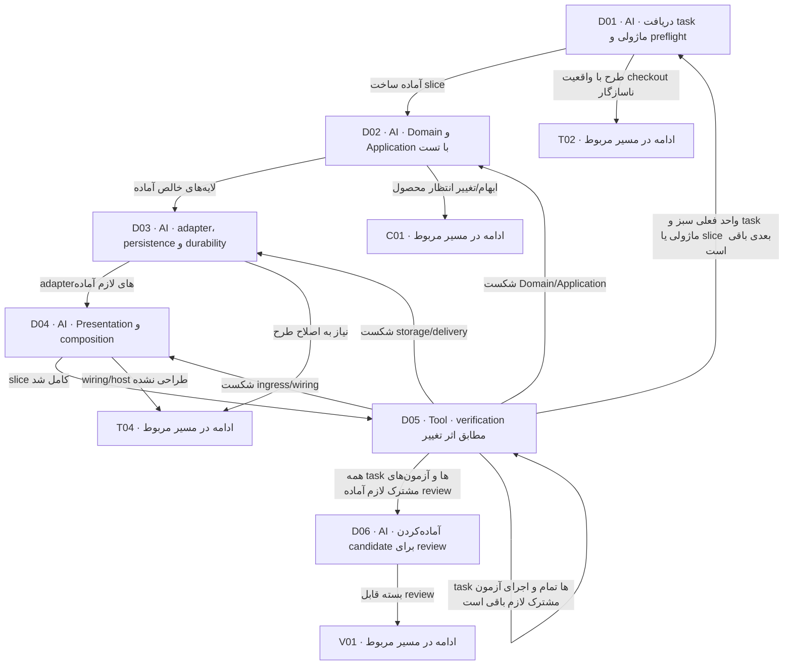

# اجرای AI توسعه‌دهنده

قرارداد اجرای مستقل آینده در Backend؛ خارج scope agent product-workflow/setup که Backend را فقط می‌خواند. یک vertical slice کوچک را کامل کن و سپس slice بعدی را بساز. تست هر لایه همراه همان لایه است؛ هیچ مرحله‌ای تضمین‌های لازم را به بعد از تحویل موکول نمی‌کند.

> کارت‌ها از [graph.json](graph.json) تولید می‌شوند. توقف، انتظار و retry مشترک در [قرارداد node](00-node-contract.md) اعمال می‌شود.

## D01 — دریافت task ماژولی و preflight

**مجری:** AI — Developer

**ورودی:** بسته T معتبر، مجوز scope، revision هدف و Backend AGENTS؛ منابع setup و baseline معماری هدف طبق docs/15-setup-bound-architecture.md

**کار دقیق:** این کارت قرارداد اجرای مستقل آینده در Backend است؛ agent product-workflow/setup آن را برای تغییر/اجرای ابزار Backend ادامه نمی‌دهد و در T08/HOLD تحویل می‌دهد. receipt agent را ثبت؛ hashها و وضعیت checkout/تغییرهای کاربر را بررسی کن. doctor/explain و workflow مناسب؛ work record بساز. dry-run scaffold لازم را بررسی و در scope apply کن. profile جدید بدون review انسانی apply نمی‌شود. task آمادهٔ بعدی را از implementation-plan بردار؛ targetId، IMPACT-ID، workUnit و prerequisites را ثبت کن. برای همان baseline معتبر، discovery کامل doctor/explain بدون تغییر بی‌دلیل تکرار نمی‌شود؛ preflight setup برای شروع/ادامه طبق AGENTS هدف همچنان لازم است و تغییر input دوباره بررسی می‌خواهد. هر task مشترک allowed paths و یک مسئول مشخص دارد. تیم توسعه فایل task اجرایی را در development/ از مشخصات implementation-plan مصوب می‌سازد؛ برنامهٔ فنی و اسناد محصول/QA فقط خواندنی‌اند. قبل از ابزار یا scaffold، writeScope و مالکیت همهٔ خروجی‌ها بررسی شوند. پیش از ایجاد/تغییر Spec/Plan/Task یا آغاز/ادامه task در Backend، check-development معتبر طبق AGENTS همان مخزن لازم است؛ preflight setup جاری با وجود task قبلی حذف نمی‌شود. setup/قواعد را با baseline T تطبیق بده؛ تغییر منابع به تحلیل اثر می‌رود. مجوز task، اختیار تغییر اسناد فنی تیم دیگر یا baseline معماری نیست.

**خروجی:** development/task، branch/snapshot ref، work record و preflight

**شرط پایان:** input تازه و writer مشخص؛ هیچ تغییر موجودی گم نشده و gateها معتبرند. setup و baseline معماری جاری معتبر و با ورودی مصوب منطبق‌اند.

| نتیجه | node بعدی |
|---|---|
| آماده ساخت slice | [D02](05-implementation.md#d02) |
| طرح با واقعیت checkout ناسازگار | [T02](04-technical.md#t02) |

## D02 — Domain و Application با تست

**مجری:** AI — Developer

**ورودی:** task و spec همان slice، QA mapping

**کار دقیق:** این کارت قرارداد اجرای مستقل آینده در Backend است؛ agent product-workflow/setup آن را برای تغییر/اجرای ابزار Backend ادامه نمی‌دهد و در T08/HOLD تحویل می‌دهد. قراردادها، pure domain/value/factory/restore و use case execute/ports/auth/outcome را بساز. deterministic tests برای success/rejection/no partial mutation/denial بنویس. query بدون Domain gate را با دلیل N/A ثبت کن. اگر task صرفاً سنجش سازگاری است، نبود کار Domain/Application را با دلیل ثبت کن؛ به‌خاطر داشتن پوشهٔ ماژول کد مصنوعی تولید نکن.

**خروجی:** کد و focused tests لایه‌های خالص، task progress

**شرط پایان:** behavior مطابق TECH و rule؛ framework/IO وارد هسته نشده.

| نتیجه | node بعدی |
|---|---|
| لایه‌های خالص آماده | [D03](05-implementation.md#d03) |
| ابهام/تغییر انتظار محصول | [C01](07-change-and-bug.md#c01) |

## D03 — adapter، persistence و durability

**مجری:** AI — Developer

**ورودی:** ports، data/delivery/integration specs و QA recovery scenarios

**کار دقیق:** این کارت قرارداد اجرای مستقل آینده در Backend است؛ agent product-workflow/setup آن را برای تغییر/اجرای ابزار Backend ادامه نمی‌دهد و در T08/HOLD تحویل می‌دهد. JPA/mapper/Work، migration افزایشی، receipt/audit/Outbox/Inbox و provider ACL لازم را پیاده کن. network خارج transaction؛ real-store tests برای atomicity/concurrency/unknown اجرا کن. component نامرتبط نساز. برای task بدون adapter/storage change، این لایه با دلیل N/A است؛ تست موجودِ لازم طبق test-mapping همچنان اجرا می‌شود.

**خروجی:** adapter و migrations/test evidence مربوط با موارد blocked صریح

**شرط پایان:** مسیر storage/delivery قابل اثبات است؛ mock جای real-store نگرفته.

| نتیجه | node بعدی |
|---|---|
| adapterهای لازم آماده | [D04](05-implementation.md#d04) |
| نیاز به اصلاح طرح | [T04](04-technical.md#t04) |

## D04 — Presentation و composition

**مجری:** AI — Developer

**ورودی:** input/error/API و host/config specs

**کار دقیق:** این کارت قرارداد اجرای مستقل آینده در Backend است؛ agent product-workflow/setup آن را برای تغییر/اجرای ابزار Backend ادامه نمی‌دهد و در T08/HOLD تحویل می‌دهد. entrypoint owner-local و mapping دقیق، trusted context، OpenAPI audience و route/spec tests بساز. Maven/policy/exports/wiring/feature-off و startup validation را ثبت و تست کن. host فقط wiring؛ ownerهای نمونه را تصادفی فعال نکن. wiring مشترک فقط در task مالک آن و با dependency معلوم تغییر می‌کند؛ task ماژولی نباید فایل مشترک متعلق به writer دیگر را بی‌هماهنگی ویرایش کند. لایهٔ نامتأثر با دلیل N/A ثبت شود.

**خروجی:** کد ingress/composition و boundary tests، یادداشت اجرای متعلق به توسعه؛ درخواست اصلاح اسناد طراحی به تیم فنی

**شرط پایان:** هر route و capability واقعی contract و registration و تست دارد.

| نتیجه | node بعدی |
|---|---|
| slice کامل شد | [D05](05-implementation.md#d05) |
| wiring/host طراحی نشده | [T04](04-technical.md#t04) |

## D05 — verification مطابق اثر تغییر

**مجری:** Tool — Check runner زیر مسئولیت Developer

**ورودی:** diff واقعی، QA/TECH mapping و policy suites

**کار دقیق:** این کارت قرارداد اجرای مستقل آینده در Backend است؛ agent product-workflow/setup آن را برای تغییر/اجرای ابزار Backend ادامه نمی‌دهد و در T08/HOLD تحویل می‌دهد. focused checks سپس verify changed و suiteهای واقعی لازم را اجرا کن؛ command، revision/dirty/hash، environment، count/fail/error/skip و report ثبت کن. full در scope release/تغییرهای لازم طبق Backend اجرا می‌شود. prerequisite غایب blocked است. ابتدا evidence همان target/task را ثبت کن. پس از آمادگی targetهای لازم، suiteهای integration/end-to-end مشترک روی candidate واحد اجرا شوند. موفقیت محلی به‌تنهایی شرط D06 نیست.

**خروجی:** evidence اجرا با scope و freshness

**شرط پایان:** تمام تست‌های لازم این slice واقعاً اجرا و pass؛ skip/صفر تست پنهان نیست.

| نتیجه | node بعدی |
|---|---|
| شکست Domain/Application | [D02](05-implementation.md#d02) |
| شکست storage/delivery | [D03](05-implementation.md#d03) |
| شکست ingress/wiring | [D04](05-implementation.md#d04) |
| واحد فعلی سبز و task ماژولی یا slice بعدی باقی است | [D01](05-implementation.md#d01) |
| همه taskها و آزمون‌های مشترک لازم آماده review | [D06](05-implementation.md#d06) |
| taskها تمام و اجرای آزمون مشترک لازم باقی است | [D05](05-implementation.md#d05) |

## D06 — آماده‌کردن candidate برای review

**مجری:** AI — Developer

**ورودی:** کد و docs نهایی، evidence و taskهای تکمیل‌شده

**کار دقیق:** این کارت قرارداد اجرای مستقل آینده در Backend است؛ agent product-workflow/setup آن را برای تغییر/اجرای ابزار Backend ادامه نمی‌دهد و در T08/HOLD تحویل می‌دهد. candidate revision/diff digest را ثابت کن؛ coverage QA→test/evidence و acceptance record، PR/delivery draft، محدودیت و migration/recovery را آماده کن. review package را از ورودی‌های منجمد بساز. impact-map و سناریوهای QA فقط با reference نسخه‌دار استفاده شوند؛ تغییر لازم به تیم مالک برگردد و در بستهٔ توسعه بازنویسی نشود.

**خروجی:** candidate manifest و review packet؛ ادعای merged/deployed ندارد جدول آمادگی ماژول‌ها، evidence مشترک و impact-map نهایی به همان candidate.

**شرط پایان:** evidence به همین candidate متصل و همه taskهای scope تعیین تکلیف‌اند.

| نتیجه | node بعدی |
|---|---|
| بسته قابل review | [V01](06-review-and-acceptance.md#v01) |
