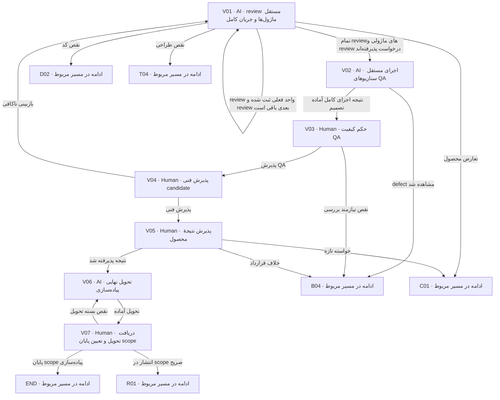

# review، اجرای QA و تحویل

review مستقل پیش از پذیرش نهایی است. کد و شواهد بعد از تغییر باید دوباره متناسب بررسی شوند. نبود یافتهٔ AI جای پذیرش QA/فنی/محصول نیست.

> کارت‌ها از [graph.json](graph.json) تولید می‌شوند. توقف، انتظار و retry مشترک در [قرارداد node](00-node-contract.md) اعمال می‌شود.

## V01 — review مستقل ماژول‌ها و جریان کامل

**مجری:** AI — Code reviewer مستقل یا reviewer انسانی

**ورودی:** candidate، P/Q/T، diff، Backend rules و reports

**کار دقیق:** به ترتیب invariant/contract، Domain، Application، adapter، entrypoint/composition و recovery review کن. POM/import/SQL و graphها را ببین؛ evidence freshness را بسنج. finding با خط/شاهد/اثر و مسیر برگشت بده. workUnit review هر target را جدا ثبت کن و پس از آن review request را برای قراردادها، wiring، ترتیب migration/rollout و outcome سرتاسری انجام بده. جمع local-readyها بدون review کل کافی نیست.

**خروجی:** code review report مستقل و وضعیت هر finding

**شرط پایان:** blocker صفر؛ self-review مستقل معرفی نشده؛ نبود تست لازم یافته است.

| نتیجه | node بعدی |
|---|---|
| نقص کد | [D02](05-implementation.md#d02) |
| نقص طراحی | [T04](04-technical.md#t04) |
| تعارض محصول | [C01](07-change-and-bug.md#c01) |
| تمام reviewهای ماژولی و review درخواست پذیرفته‌اند | [V02](06-review-and-acceptance.md#v02) |
| review واحد فعلی ثبت شده و review بعدی باقی است | [V01](06-review-and-acceptance.md#v01) |

## V02 — اجرای مستقل سناریوهای QA

**مجری:** AI — QA executor با ابزار و نظارت QA owner

**ورودی:** candidate ثابت، سناریوهای G-Q و test mapping، environment آماده

**کار دقیق:** برنامه QA را اجرا یا report معتبر همان candidate را مستقلاً بررسی کن؛ exploratory/دستی لازم را به QA owner بسپار. pass/fail/blocked/not-run را جدا ثبت؛ mismatch را defect با actual/expected/source کن. گزارش باید نتیجهٔ QAهای module و integration و end-to-end لازم را از هم جدا کند و targetها و IMPACT/EDGE/FLOW و candidate مشترک را برای هر evidence نشان دهد.

**خروجی:** qa execution report و defectها؛ counts و artifact references

**شرط پایان:** هر سناریوی لازم status و evidence/علت دارد؛ نتیجه اختراع نشده.

| نتیجه | node بعدی |
|---|---|
| نتیجه اجرای کامل آماده تصمیم | [V03](06-review-and-acceptance.md#v03) |
| defect مشاهده شد | [B04](07-change-and-bug.md#b04) |

## V03 — حکم کیفیت QA

**مجری:** Human — QA owner

**ورودی:** execution، coverage، defectها و evidence candidate

**کار دقیق:** پوشش، flaky/skip، critical risk و regression را بررسی کن. blocker یا تست ضروری blocked پذیرش ندارد. minor residual با owner/موعد قابل ثبت است.

**خروجی:** QA acceptance همان candidate یا درخواست اصلاح

**شرط پایان:** QA معیار exit را با شاهد پذیرفته است.

| نتیجه | node بعدی |
|---|---|
| پذیرش QA | [V04](06-review-and-acceptance.md#v04) |
| نقص نیازمند بررسی | [B04](07-change-and-bug.md#b04) |

## V04 — پذیرش فنی candidate

**مجری:** Human — Tech lead با رأی مسئولان فنی targetهای متأثر

**ورودی:** code review، QA verdict، evidence، docs و migration/runbook

**کار دقیق:** سلامت طراحی/کد، محدودیت runtime، compatibility و recovery را بررسی کن؛ اگر candidate عوض شده approval قبلی کافی نیست. merge مجزا از این رأی است. رأی فنی هر target و جمع‌بندی outcome کل درخواست را روی همان candidate ثبت کن؛ یک فرد با انتساب صریح می‌تواند چند مسئولیت داشته باشد.

**خروجی:** technical acceptance candidate

**شرط پایان:** review مستقل و شواهد لازم معتبرند و blocker فنی صفر است.

| نتیجه | node بعدی |
|---|---|
| پذیرش فنی | [V05](06-review-and-acceptance.md#v05) |
| بازبینی ناکافی | [V01](06-review-and-acceptance.md#v01) |

## V05 — پذیرش نتیجهٔ محصول

**مجری:** Human — همان درخواست‌کننده با نمایندهٔ محصول

**ورودی:** نمایش نتیجه/شواهد AC، خلاصهٔ scope و محدودیت، رأی QA/فنی

**کار دقیق:** تحقق رفتار scope را روی همین candidate بپذیر. خواستهٔ تازه change است؛ رفتار خلاف قرارداد defect است. نمونهٔ UI لازم می‌تواند توسط QA ارائه شود؛ فرض وجود frontend نکن.

**خروجی:** product acceptance و G-D کامل یا feedback دسته‌بندی‌شده

**شرط پایان:** پذیرش صریح نتیجهٔ scope؛ هیچ fail ضروری با رضایت مبهم پوشانده نشده.

| نتیجه | node بعدی |
|---|---|
| نتیجه پذیرفته شد | [V06](06-review-and-acceptance.md#v06) |
| خواسته تازه | [C01](07-change-and-bug.md#c01) |
| خلاف قرارداد | [B04](07-change-and-bug.md#b04) |

## V06 — تحویل نهایی پیاده‌سازی

**مجری:** AI — Coordinator

**ورودی:** G-D، candidate، reports و docs

**کار دقیق:** delivery record بنویس: چه تغییر کرد، چرا، evidence، residual، migration/runbook، وضعیت دقیق ready-to-merge/merged/deployed با شاهد. manifest نهایی و read order گیرنده را ثبت کن.

**خروجی:** development/delivery و final manifest خلاصهٔ تحویل هر ماژول و تحقق جریان مشترک؛ target بدون تغییر کد با evidence سازگاری.

**شرط پایان:** هر ادعا شاهد دارد و next owner/عمل مشخص است.

| نتیجه | node بعدی |
|---|---|
| تحویل آماده | [V07](06-review-and-acceptance.md#v07) |

## V07 — دریافت تحویل و تعیین پایان scope

**مجری:** Human — مسئول دریافت فنی / درخواست‌کننده

**ورودی:** delivery و candidate قابل دسترسی

**کار دقیق:** دریافت بسته را ثبت کن. اگر scope فقط پیاده‌سازی/review بوده پرونده پایان می‌یابد. اگر انتشار صریحاً خواسته شده، اختیار و target در مسیر R بررسی می‌شود.

**خروجی:** delivery receipt و وضعیت accepted/closed یا release-pending

**شرط پایان:** گیرنده همان نسخه را دریافت کرده؛ پایان محصول با انتشار اشتباه نشده.

| نتیجه | node بعدی |
|---|---|
| پایان scope پیاده‌سازی | END |
| انتشار در scope صریح | [R01](08-release.md#r01) |
| نقص بسته تحویل | [V06](06-review-and-acceptance.md#v06) |
