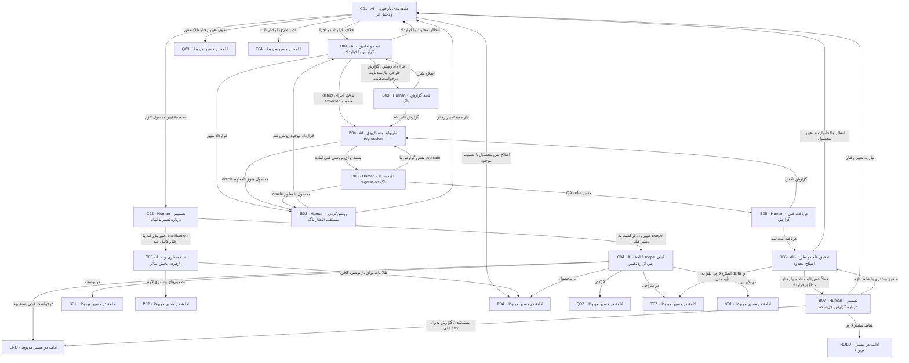

# تغییر، باگ و بازگشت هدفمند

C nodeها نسخه و scope را مدیریت می‌کنند؛ B nodeها گزارش خلاف قرارداد را. مسیر کوتاه باگ قرارداد محصول را دوباره اختراع نمی‌کند و دریافت فنی با رفع نهایی فرق دارد.

> کارت‌ها از [graph.json](graph.json) تولید می‌شوند. توقف، انتظار و retry مشترک در [قرارداد node](00-node-contract.md) اعمال می‌شود.

## C01 — طبقه‌بندی بازخورد و تحلیل اثر

**مجری:** AI — Coordinator با owner مرحلهٔ گزارش‌دهنده

**ورودی:** feedback، originNode، baseline و rule/scenario/TECHهای متأثر

**کار دقیق:** تشخیص بده: typo/نقص سند با تصمیم موجود، gap تصمیم، تغییر خواسته، QA gap، طراحی یا defect. impact و dependent IDs و resumeNode را ثبت کن. برای ادغام‌شده پرونده تغییر؛ وضعیت نامعلوم را از درخواست‌کننده مستقیم بپرس. impact-map ماژولی را هم به‌روز کن؛ تغییر provider contract باید اثر روی consumerها و QA integration/end-to-end را بررسی کند. targetهای unaffected فقط با شاهد معتبر خارج ابطال می‌مانند. اصلاحیه را با مبدأ/مقصد تیم و node، نسخه، دلیل، بخش‌های متأثر، اصلاح مورد انتظار و مرجع گزارش در tracking ثبت کن؛ برد کارت را در برگشتی تیم مقصد نشان دهد و کار وابسته تا رفع علت متوقف بماند. پس از اصلاح، review/approval لازم و دریافت مجدد نسخهٔ معتبر، اصلاحیه با شاهد بسته شود. مقصد اصلاح تیم مالک فایل است؛ Coordinator و تیم گزارش‌دهنده فایل آن تیم را نمی‌نویسند. انتخاب nextNode به‌تنهایی اجازهٔ اجرای نقش نویسندهٔ تیم مقصد نیست.

**خروجی:** change-impact با نوع و محدودهٔ ابطال، current/desired و source

**شرط پایان:** مسئله به صاحب واقعی ارجاع شده؛ هر بازخورد مصاحبه تازه نمی‌سازد.

| نتیجه | node بعدی |
|---|---|
| اصلاح متن محصول با تصمیم موجود | [P04](02-product.md#p04) |
| نقص QA بدون تغییر رفتار | [Q03](03-qa.md#q03) |
| نقص طرح با رفتار ثابت | [T04](04-technical.md#t04) |
| خلاف قرارداد در اجرا | [B01](07-change-and-bug.md#b01) |
| تصمیم/تغییر محصول لازم | [C02](07-change-and-bug.md#c02) |

## C02 — تصمیم درباره تغییر یا ابهام

**مجری:** Human — درخواست‌کننده؛ Product owner جمع‌بندی می‌کند

**ورودی:** current/desired، impact و سؤال مؤثر با قالب مصاحبه برای تغییر رفتار

**کار دقیق:** رفتار/دامنهٔ تازه را تصمیم بگیر یا تغییر را رد کن. پاسخ مستقیم برای clarification کافی است؛ تغییر رفتار مسیر کامل نگارش/review را دارد. سابقه پاسخ قدیمی حفظ شود.

**خروجی:** decision با accepted/rejected و scope؛ نه approval بستهٔ هنوز نوشته‌نشده

**شرط پایان:** تصمیم رفتاری روشن یا مورد باز با owner؛ رأی فقط تصمیم را می‌بندد.

| نتیجه | node بعدی |
|---|---|
| تغییر پذیرفته یا clarification رفتار کامل شد | [C03](07-change-and-bug.md#c03) |
| تغییر رد؛ بازگشت به scope معتبر قبلی | [C04](07-change-and-bug.md#c04) |

## C03 — نسخه‌سازی و بازکردن بخش متأثر

**مجری:** AI — Coordinator

**ورودی:** تصمیم C02 و impact graph

**کار دقیق:** revision تازه بساز؛ approvals/evidence پایین‌دست متأثر را stale علامت بزن، تاریخچه را نگه دار. بخش‌های مستقل با دلیل unaffected باقی بمانند. rule/UC/AC متأثر را برای نگارش علامت بزن.

**خروجی:** baseline candidate جدید، stale list و تصمیم‌های superseded

**شرط پایان:** هیچ approval روی bytes جدید کپی نشده؛ scope مصوب قبلی محفوظ است.

| نتیجه | node بعدی |
|---|---|
| تصمیم‌های بیشتری لازم | [P02](02-product.md#p02) |
| اطلاعات برای بازنویسی کافی | [P04](02-product.md#p04) |

## C04 — ادامهٔ scope قبلی پس از رد تغییر

**مجری:** AI — Coordinator

**ورودی:** تصمیم رد، originNode و baseline پیشین

**کار دقیق:** بررسی کن baseline قبلی هنوز معتبر و کار وابسته به تغییر انجام نشده است؛ drafts تغییر ردشده را archived/reference کن، نه مرجع جاری. از مرحلهٔ متوقف‌شده ادامه بده؛ اگر قبلاً تحویل بسته شده بود END.

**خروجی:** resume record و baseline معتبر انتخاب‌شده

**شرط پایان:** scope قبلی واقعاً قابل ادامه؛ ابهام blocker با رد تغییر پنهان نشده.

| نتیجه | node بعدی |
|---|---|
| در محصول | [P04](02-product.md#p04) |
| در QA | [Q02](03-qa.md#q02) |
| در طراحی | [T02](04-technical.md#t02) |
| در توسعه | [D01](05-implementation.md#d01) |
| در پذیرش | [V01](06-review-and-acceptance.md#v01) |
| درخواست قبلی بسته بود | END |

## B01 — ثبت و تطبیق گزارش با قرارداد

**مجری:** AI — Coordinator / QA analyst

**ورودی:** شرح observed behavior، environment امن و قرارداد مبنا

**کار دقیق:** actual/expected را جدا و rule/AC را پیدا کن. نبود بازتولید گزارش را حذف نمی‌کند. اگر از V02 آمده، actual evidence را حفظ کن. انتظار تازه change است.

**خروجی:** bug report با reported/unconfirmed status و source

**شرط پایان:** گزارش امن و انتساب انتظار مشخص یا ابهام دقیق معلوم است.

| نتیجه | node بعدی |
|---|---|
| قرارداد روشن؛ گزارش خارجی نیازمند تأیید درخواست‌کننده | [B03](07-change-and-bug.md#b03) |
| قرارداد مبهم | [B02](07-change-and-bug.md#b02) |
| انتظار متفاوت با قرارداد | [C01](07-change-and-bug.md#c01) |
| defect اجرای QA با expected مصوب | [B04](07-change-and-bug.md#b04) |

## B02 — روشن‌کردن مستقیم انتظار باگ

**مجری:** Human — همان درخواست‌کننده

**ورودی:** یک سؤال مستقیم درباره انتظار/مالکیت نامعلوم و گزارش فعلی

**کار دقیق:** به قاعده موجود یا انتظار روشن ارجاع بده. batch مصاحبهٔ ماژول ساخته نمی‌شود؛ اگر نیاز جدید می‌خواهی آن را change اعلام کن.

**خروجی:** clarification با reference

**شرط پایان:** انتظار از گزارش واقعی جدا و پاسخ دقیق ثبت شده.

| نتیجه | node بعدی |
|---|---|
| قرارداد موجود روشن شد | [B01](07-change-and-bug.md#b01) |
| نیاز جدید/تغییر رفتار | [C01](07-change-and-bug.md#c01) |

## B03 — تأیید گزارش باگ

**مجری:** Human — همان درخواست‌کننده

**ورودی:** متن کامل گزارش، rule/AC و manifest bug

**کار دقیق:** صحت شرح گزارش را روی نسخه مشخص تأیید یا اصلاح کن. این رأی اثبات root cause یا موفقیت fix نیست. بسته باید معنای expectation و ruleهای ارجاع‌شده را برای همین گزارش روشن کند؛ اگر baseline محصول معتبر نیست، قبل ادامه G-P روی قرارداد لازم گرفته شود.

**خروجی:** bug approval جدا و وضعیت آماده بررسی فنی

**شرط پایان:** تأیید صریح گزارش موجود است.

| نتیجه | node بعدی |
|---|---|
| گزارش تأیید شد | [B04](07-change-and-bug.md#b04) |
| اصلاح شرح | [B01](07-change-and-bug.md#b01) |

## B04 — بازتولید و سناریوی regression

**مجری:** AI — QA analyst با ابزار

**ورودی:** bug یا failed scenario، candidate و expected مصوب

**کار دقیق:** بازتولید کنترل‌شده با داده ساختگی را انجام/طراحی کن؛ reproducible/intermittent/not-reproduced ثبت کن. سناریوی regression و دامنه اثر بنویس؛ عدم بازتولید دلیل بی‌اعتباری گزارش نیست. در حین توسعه defect زیرپرونده همان request است.

**خروجی:** QA bug packet، regression scenario، observed evidence و severity پیشنهادی

**شرط پایان:** تیم فنی می‌داند چه چیز معلوم و چه چیز فرض است.

| نتیجه | node بعدی |
|---|---|
| بسته برای بررسی فنی آماده | [B08](07-change-and-bug.md#b08) |
| oracle محصول هنوز نامعلوم | [B02](07-change-and-bug.md#b02) |

## B08 — تأیید بستهٔ regression باگ

**مجری:** Human — QA owner

**ورودی:** گزارش B04، oracle قرارداد موجود، regression scenario و manifest delta QA

**کار دقیق:** پوشش و expected result را برای همین اصلاح تأیید کن. برای defect جاری اگر همان سناریوی قبلاً مصوب بدون تغییر است، مرجع G-Q معتبر را reuse و عدم تغییر را ثبت کن؛ سناریوی تازه یا تغییرکرده رأی نسخه تازه می‌خواهد. مصاحبه محصول لازم نیست مگر رفتار تغییر کند.

**خروجی:** G-Q delta approval یا ارجاع معتبر به G-Q موجود؛ گزارش باگ خارجی G-P/report approval خودش را حفظ می‌کند.

**شرط پایان:** برنامهٔ QA ورودی فنی تأیید معتبر دارد؛ report approval با اثبات fix اشتباه نشده.

| نتیجه | node بعدی |
|---|---|
| QA delta معتبر | [B05](07-change-and-bug.md#b05) |
| نقص گزارش یا scenario | [B04](07-change-and-bug.md#b04) |
| oracle محصول نامعلوم | [B02](07-change-and-bug.md#b02) |

## B05 — دریافت فنی گزارش

**مجری:** Human — Tech lead

**ورودی:** bug packet، approval خارجی در صورت نیاز و expected baseline

**کار دقیق:** دریافت همان نسخه و مسئول investigation را ثبت کن؛ برای defect جاری از مسئولیت ازپیش‌ثبت‌شده استفاده شود و جلسه تازه لازم نیست. پایان گردش محصولی باگ اینجاست، نه پایان اصلاح.

**خروجی:** technical acknowledgment و investigation owner

**شرط پایان:** فنی مسئولیت بررسی را پذیرفته است.

| نتیجه | node بعدی |
|---|---|
| دریافت ثبت شد | [B06](07-change-and-bug.md#b06) |
| گزارش ناقص | [B04](07-change-and-bug.md#b04) |

## B06 — تحقیق علت و طرح اصلاح محدود

**مجری:** AI — Technical designer / Developer در نقش investigation

**ورودی:** گزارش، regression، Backend bug workflow و source

**کار دقیق:** source→failure و caller/contract/data impact را trace کن؛ fact را از hypothesis جدا. برای fix، plan و test mapping متناسب تهیه و T02 را برای review delta ادامه بده؛ کد بدون scope/طراحی معتبر تغییر نکند. حتی fix تک‌ماژولی یک impact-map کوچک دارد؛ dependencyهای باگ از بررسی حذف نمی‌شوند.

**خروجی:** bug investigation با root cause یا unknown، fix proposal و affected IDs

**شرط پایان:** نتیجه به شاهد متصل؛ existing design کافی بودن مستدل، نه gate bypass.

| نتیجه | node بعدی |
|---|---|
| اصلاح لازم؛ طراحی delta و تأیید فنی | [T02](04-technical.md#t02) |
| فعلاً نقص ثابت نشده یا رفتار مطابق قرارداد | [B07](07-change-and-bug.md#b07) |
| انتظار واقعاً نیازمند تغییر محصول | [C01](07-change-and-bug.md#c01) |

## B07 — تصمیم درباره گزارش حل‌نشده

**مجری:** Human — QA owner و درخواست‌کننده با Tech lead

**ورودی:** investigation، evidence و نتیجهٔ inconclusive/as-designed

**کار دقیق:** بستن با دلیل، انتظار شاهد بیشتر یا تبدیل به change را تصمیم بگیر. not-reproduced هرگز fixed گزارش نشود. دادهٔ حساس برای شاهد نخواه.

**خروجی:** closure/inconclusive decision یا درخواست بررسی مشخص

**شرط پایان:** وضعیت گزارش صادقانه و owner ادامه روشن است.

| نتیجه | node بعدی |
|---|---|
| بسته‌شدن گزارش بدون ادعای fix | END |
| شاهد بیشتر لازم | HOLD |
| نیاز به تغییر رفتار | [C01](07-change-and-bug.md#c01) |
| تحقیق بیشتری با شاهد تازه | [B06](07-change-and-bug.md#b06) |
