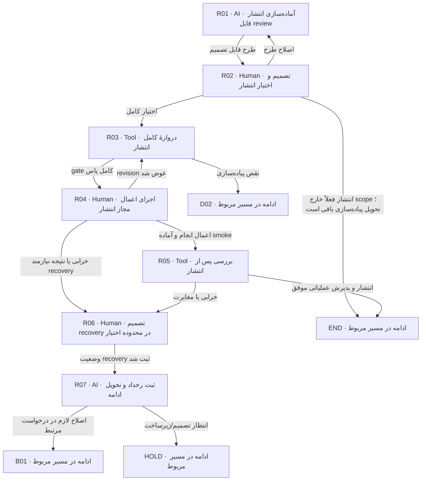

# انتشار و عملیات، در صورت درخواست

این مسیر فقط پس از تحویل و با اختیار صریح انتشار اجرا می‌شود. آماده‌بودن فنی یا approval اسناد به‌تنهایی اختیار merge/deploy نیست.

> کارت‌ها از [graph.json](graph.json) تولید می‌شوند. توقف، انتظار و retry مشترک در [قرارداد node](00-node-contract.md) اعمال می‌شود.

## R01 — آماده‌سازی انتشار قابل review

**مجری:** AI — Developer / Coordinator

**ورودی:** G-D، artifact candidate، target و release request

**کار دقیق:** release plan و migration/expand-backfill-contract، compatibility، backup/restore، flags، smoke، rollback/roll-forward و operator را آماده کن. secret فقط reference. target واقعی و توان host را بررسی کن.

**خروجی:** release packet و action list دقیق merge/deploy/rollback

**شرط پایان:** اثر و اختیار لازم هر action روشن؛ discovery پیش از درخواست اجازه انجام شده.

| نتیجه | node بعدی |
|---|---|
| طرح قابل تصمیم | [R02](08-release.md#r02) |

## R02 — تصمیم و اختیار انتشار

**مجری:** Human — Release owner مجاز

**ورودی:** release packet، target و اعمال دقیق

**کار دقیق:** اختیار merge/deploy و در صورت نیاز rollback محدوده‌دار را تأیید کن؛ اگر قبلاً صریحاً داده شده، همان مرجع معتبر ثبت و دوباره سؤال نشود. prerequisite و پنجره عملیات را تأیید کن.

**خروجی:** authorization با target/actions/حدود و reference

**شرط پایان:** اختیار همان عمل و مقصد موجود؛ سکوت یا G-D جایگزین نیست.

| نتیجه | node بعدی |
|---|---|
| اختیار کامل | [R03](08-release.md#r03) |
| اصلاح طرح | [R01](08-release.md#r01) |
| انتشار فعلاً خارج scope؛ تحویل پیاده‌سازی باقی است | END |

## R03 — دروازهٔ کامل انتشار

**مجری:** Tool — Release check runner

**ورودی:** candidate دقیق، release plan و محیط واقعی لازم

**کار دقیق:** verify full و تمام الزامات policy release جاری را اجرا؛ current-run reports، artifact/JAR/SBOM و checksum ledger را بررسی کن. بعد merge/rebase تغییر revision نیازمند evidence جدید یا تأیید equivalence مستدل طبق policy است.

**خروجی:** release evidence commit-bound

**شرط پایان:** هیچ report stale، skipped required test یا dirty artifact نامعتبر نیست.

| نتیجه | node بعدی |
|---|---|
| gate کامل پاس | [R04](08-release.md#r04) |
| نقص پیاده‌سازی | [D02](05-implementation.md#d02) |

## R04 — اجرای اعمال مجاز انتشار

**مجری:** Human — Operator / agent با اختیار همان operator

**ورودی:** authorization معتبر، artifact verify‌شده و runbook

**کار دقیق:** فقط actionهای مصوب را به ترتیب اجرا؛ migration با principal جدا و serving بدون DDL. نتیجه هر action و readback ثبت؛ timeout اثرنامعلوم را با retry کور جبران نکن. اگر candidate تغییر کرد R03.

**خروجی:** deployment/merge record با target، revision و اثر قطعی

**شرط پایان:** عمل‌ها قابل انتساب و تحقق یا failure آن‌ها مشاهده شده‌اند.

| نتیجه | node بعدی |
|---|---|
| اعمال انجام و آماده smoke | [R05](08-release.md#r05) |
| revision عوض شد | [R03](08-release.md#r03) |
| خرابی یا نتیجه نیازمند recovery | [R06](08-release.md#r06) |

## R05 — بررسی پس از انتشار

**مجری:** Tool — QA / عملیات

**ورودی:** deployment record و smoke/monitoring plan

**کار دقیق:** smoke رفتار، migration، health، consumer lag و سیگنال‌های موردنیاز را اجرا؛ نبود metric را صفر خطا ننام. نتیجه و receipt عملیات ثبت شود.

**خروجی:** post-release evidence و operational receipt

**شرط پایان:** شرط خروج release plan پاس و مالک عملیات دریافت کرده است.

| نتیجه | node بعدی |
|---|---|
| انتشار و پذیرش عملیاتی موفق | END |
| خرابی یا مغایرت | [R06](08-release.md#r06) |

## R06 — تصمیم recovery در محدوده اختیار

**مجری:** Human — Release owner / operator

**ورودی:** failure evidence، آثار انجام‌شده و rollback/roll-forward plan

**کار دقیق:** بر اساس وضعیت واقعی، rollback/roll-forward/reconcile مجاز را انتخاب و اجرا یا دستور بده. دادهٔ تغییرکرده با rollback binary لزوماً برنمی‌گردد. اگر اختیار موجود نیست انتظار تصمیم ثبت شود.

**خروجی:** recovery decision و execution/readback evidence

**شرط پایان:** اثر recovery قطعی یا remaining unknown با owner ثبت شده.

| نتیجه | node بعدی |
|---|---|
| وضعیت recovery ثبت شد | [R07](08-release.md#r07) |

## R07 — ثبت رخداد و تحویل ادامه

**مجری:** AI — Coordinator

**ورودی:** recovery evidence و scope آسیب

**کار دقیق:** انتشار را failed/recovered/blocked دقیق ثبت؛ incident و اقدام بعدی را با owner تحویل بده. تحویل پیاده‌سازی قبلی را موفقیت production معرفی نکن. فقط با receipt و evidence واقعی، Coordinator observation انتشار در implementation/ همان ماژول ثبت می‌کند؛ طرح مصوب تغییر نمی‌کند.

**خروجی:** incident handover و reopen/bug reference

**شرط پایان:** کارهای باقی‌مانده و نیاز انسان مشخص؛ پرونده release تا پذیرش دوباره موفق نیست.

| نتیجه | node بعدی |
|---|---|
| اصلاح لازم در درخواست مرتبط | [B01](07-change-and-bug.md#b01) |
| انتظار تصمیم/زیرساخت | HOLD |
